# 项目一报告

|  姓名  |     学号      |            分工            | 贡献率 |
| :----: | :-----------: | :------------------------: | :----: |
| 蔡与望 | 2020010801024 |   程序编写调试、报告撰写   |  35%   |
| 党一琨 | 2020140903010 | 共享信道仿真实验、程序调试 |  20%   |
| 郭培琪 | 2020030701003 |      拓扑与帧结构设计      |  25%   |
| 陶砚青 | 2020040401013 | 共享信道仿真实验、GUI设计  |  20%   |

- [项目一报告](#项目一报告)
  - [一、整体架构](#一整体架构)
    - [1.1 网元设计](#11-网元设计)
    - [1.2 帧设计](#12-帧设计)
    - [1.3 源码总览](#13-源码总览)
      - [1.3.1 目录结构](#131-目录结构)
      - [1.3.2 网元层模块设计](#132-网元层模块设计)
  - [二、控制台](#二控制台)
  - [三、物理层](#三物理层)
    - [3.1 连接网元](#31-连接网元)
    - [3.2 模拟误码](#32-模拟误码)
    - [3.3 模拟MTU](#33-模拟mtu)
    - [3.4 模拟冗余](#34-模拟冗余)
  - [四、应用层](#四应用层)
    - [4.1 编解码文本与图片](#41-编解码文本与图片)
      - [4.1.1 文本编解码](#411-文本编解码)
      - [4.1.2 图片编解码](#412-图片编解码)
      - [4.1.3 代码实现](#413-代码实现)
    - [4.2 代码框架](#42-代码框架)
    - [4.3 阶段一测试](#43-阶段一测试)
      - [4.3.1 随机数产生与应答](#431-随机数产生与应答)
      - [4.3.2 心得与反思](#432-心得与反思)
  - [五、主机网络层](#五主机网络层)
    - [5.1 帧同步与定位](#51-帧同步与定位)
      - [5.1.1 基本原理](#511-基本原理)
      - [5.1.2 代码实现](#512-代码实现)
    - [5.2 地址读写](#52-地址读写)
      - [5.2.1 取16位的原因](#521-取16位的原因)
      - [5.2.2 代码实现](#522-代码实现)
    - [5.3 序号读写](#53-序号读写)
      - [5.3.1 取8位的原因](#531-取8位的原因)
      - [5.3.2 代码实现](#532-代码实现)
    - [5.4 差错检测](#54-差错检测)
      - [5.4.1 基本原理](#541-基本原理)
      - [5.4.2 代码实现](#542-代码实现)
    - [5.5 差错控制](#55-差错控制)
      - [5.5.1 基本原理](#551-基本原理)
      - [5.5.2 采用停等协议的原因](#552-采用停等协议的原因)
      - [5.5.3 Keepalive机制](#553-keepalive机制)
      - [5.5.4 代码实现](#554-代码实现)
    - [5.6 流量控制](#56-流量控制)
      - [5.6.1 基本原理](#561-基本原理)
      - [5.6.2 代码实现](#562-代码实现)
    - [5.7 代码框架](#57-代码框架)
    - [5.8 阶段二测试](#58-阶段二测试)
      - [5.8.1 Unicode字符I/O](#581-unicode字符io)
      - [5.8.2 文本传输容量](#582-文本传输容量)
      - [5.8.3 图片I/O](#583-图片io)
      - [5.8.4 检错与差控](#584-检错与差控)
      - [5.8.5 Keepalive机制](#585-keepalive机制)
      - [5.8.6 各项性能指标](#586-各项性能指标)
        - [5.8.6.1 吞吐量](#5861-吞吐量)
        - [5.8.6.2 误码承受能力](#5862-误码承受能力)
        - [5.8.6.3 传输延时](#5863-传输延时)
      - [5.8.7 心得与反思](#587-心得与反思)
  - [六、交换机网络层](#六交换机网络层)
    - [6.1 维护端口地址表](#61-维护端口地址表)
    - [6.2 单播广播支持](#62-单播广播支持)
    - [6.3 代码框架](#63-代码框架)
    - [6.4 阶段三测试](#64-阶段三测试)
      - [6.4.1 单播支持](#641-单播支持)
      - [6.4.2 广播支持](#642-广播支持)
      - [6.4.3 各项性能指标](#643-各项性能指标)
        - [6.4.3.1 吞吐量](#6431-吞吐量)
        - [6.4.3.2 误码承受能力](#6432-误码承受能力)
        - [6.4.3.3 传输延时](#6433-传输延时)
      - [6.4.4 心得与反思](#644-心得与反思)
  - [七、路由器网络层](#七路由器网络层)
    - [7.1 路由表](#71-路由表)
      - [7.1.1 基本原理](#711-基本原理)
      - [7.1.2 代码实现](#712-代码实现)
    - [7.2 数据定向投递](#72-数据定向投递)
      - [7.2.1 基本原理](#721-基本原理)
      - [7.2.2 代码实现](#722-代码实现)
    - [7.3 代码框架](#73-代码框架)
    - [7.4 阶段四调试](#74-阶段四调试)
      - [7.4.1 路由表计算](#741-路由表计算)
      - [7.4.2 跨网单播](#742-跨网单播)
      - [7.4.3 局域网广播](#743-局域网广播)
      - [7.4.4 各项性能指标](#744-各项性能指标)
        - [7.4.4.1 吞吐量](#7441-吞吐量)
        - [7.4.4.2 误码承受能力](#7442-误码承受能力)
        - [7.4.4.3 传输延时](#7443-传输延时)
      - [7.4.5 心得与反思](#745-心得与反思)
  - [八、总结](#八总结)
    - [8.1 指导书需求完成情况](#81-指导书需求完成情况)
    - [8.2 项目心得体会](#82-项目心得体会)
  - [九、附录](#九附录)
    - [9.1 编写与运行环境](#91-编写与运行环境)
    - [9.2 项目开源地址](#92-项目开源地址)

## 一、整体架构

### 1.1 网元设计


在我们的网络模型中，共有三种网元，它们分别是：**主机、交换机、路由器**。

其中，主机的网元分为三层，分别是**应用层、网络层、物理层**；而路由器与交换机，由于不需要与用户进行I/O操作，只设**网络层、物理层**。各层间通过套接字进行通信。

网元各层的主要功能如下：

- 物理层
  - 连接网元
  - 模拟误码
  - 模拟MTU
  - 模拟冗余
- 主机应用层
  - 决定网元模式
  - 信息I/O
  - 文本与图片的编解码
- 主机网络层
  - 帧同步与定位
  - 地址读写
  - 序号读写
  - 差错检测
  - 差错控制
  - 流量控制
- 交换机网络层
  - 维护端口地址表
  - 单播广播支持
- 路由器网络层
  - 维护路由表
  - 数据定向投递

### 1.2 帧设计

在我们的设计中，单次发送的信息将被分为多个帧，网元间以帧为单位交换信息；帧内除了用户发送的数据，还有网络层添加的各种控制信息，用于实现差控、流控、判收等功能。

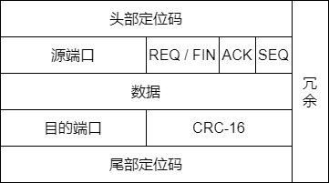

上图是我们组设计的帧结构。它包括以下这几部分：

- 帧头、帧尾（8位）
- 源地址、目的地址（16位）
- 帧序号（8位）
- 数据（不多于32位）
- CRC校验码（16位）
- 冗余（位数不等，帧同步的副产物）

具体每一部分的功能、原理与实现见第3章。

### 1.3 源码总览

程序使用`Python`编写，环境见[附录9.1节](#91-编写与运行环境)。

#### 1.3.1 目录结构

```txt
Project
├─ bin            可执行文件
├─ config         配置与备份文件
├─ log            日志文件
├─ resource       资源文件
└─ src            源代码文件
    ├─ interface  图形化界面模块
    ├─ layer      网元层模块
    └─ utils      工具模块
```

#### 1.3.2 网元层模块设计


虽然网元的各层都肩负着不同的职责，但它们身为数据的传递者，必定存在一些共性，比如都有确定的端口号和套接字、都可以收发消息等。我们将这些共性抽象出来，创建了**抽象层**（`AbstractLayer`）。它可以实现最简单的收发与`select`方法，其收发API只对子类开放，供各层实现进一步分化。在此基础上：

- **控制台**（AppLayer）增加了与用户、主机应用层交互的功能；同时拥有图形化界面（CommandGUI）；
- **主机应用层**（AppLayer）增加了与控制台、主机网络层交互的功能；
- **主机网络层**（NetLayer）增加了与主机应用层、主机物理层交互的功能；
- **交换机网络层**（SwitchLayer）增加了与主机物理层交互的功能；同时继承**端口地址表**（SwitchTable），可以对其进行CRUD操作。
- **路由器网络层**（RouterLayer）增加了与物理层交互的功能；同时继承**路由表**（RouterTable），可以对其进行查找与合并。

接下来，我们将依次展示这些网元层的功能。

## 二、控制台

为了提供一个统一、友好的控制与观测平台，我们基于`PyQt5`编写了一个拥有图形化界面的控制台。

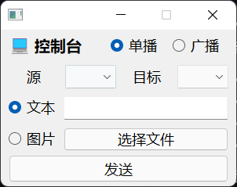

用户通过它，来统一指定消息的发送模式、源、目的、内容等信息。它负责检验用户输入的有效性，然后将输入打包，并传输给指定主机的应用层。

## 三、物理层

在整个网元中，物理层主要有四种功能：

- 连接网元
- 模拟误码
- 模拟MTU
- 模拟冗余

下面将分别展示这四种功能。

### 3.1 连接网元

在[网元设计图](#11-网元设计)中，我们可以看到不同网元间有一根根线将其互相连接。这些网元间的连接——也就是收发消息的桥梁——是物理层模拟软件提供的。在本项目中，我们将物理层设定为只能传输**bit数组**，即任意两网元在底层上只能传输0和1的比特流。

而为了连接我们拓扑中的各个网元，我们有时将打开十几个物理层软件，而一个个去手动配置它们的参数显然是不现实的。所以我们根据各阶段的拓扑图，编写了相应的配置文件`ne.txt`；在物理层启动时，它可以告诉每个物理层各自的参数。

如下图，我们实现了阶段二的，主机1与主机2相连的拓扑。


除此之外，我们还编写了批处理文件`OneTouchToGo-stageX.bat`和`OneTouchToClose.bat`，分别可以一键启动和关闭各阶段拓扑内的所有网元；这也大大降低了我们调试的难度。

下面是一键启动的原理，图中的这套配置能够一键启动阶段二的网元拓扑。

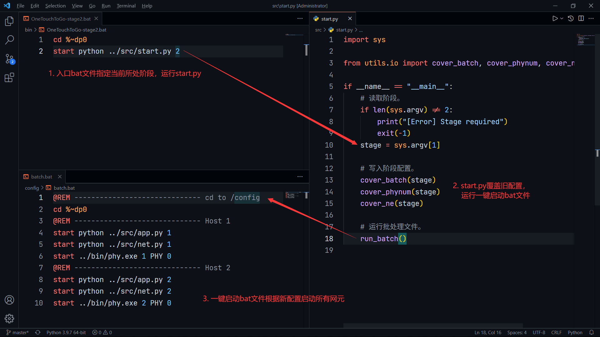

### 3.2 模拟误码

对误码的承受能力，是衡量一个通信系统性能的重要指标。物理层模拟软件可以轻松地提供对误码模拟的支持，只需要在物理层模拟软件主窗内更改误码率即可。

通过网上查阅资料、小组讨论，以及项目四调制解调的经验，我们依误码率将信道划分为三个等级：

| 误码率（十万分之） | 信道环境 |
| :----------------: | :------: |
|       0-500        |   优质   |
|      500-2000      |   一般   |
|       >2000        |   恶劣   |

### 3.3 模拟MTU

MTU（Maximum Transmission Unit），最大传输单元，也即单次允许传输的最大字节数。对于当下广泛使用的以太网标准来说，这个值为1500字节。

但实际上，我们的帧只占100余位左右，远远低于这一限制；所以我们组在此标准的基础上进行了缩小，即设物理层模拟软件的MTU为1500位，而非1500字节。（理论上，150位也是足够充裕的。）

### 3.4 模拟冗余

当我们在真实的信道中传输数据时，接收端得到的只有01比特流，而并不知道帧的起始在哪里；这就需要通信双方约定协议来解决定位问题。

为了模拟这一现象，物理层模拟软件会在传输的信息前后各添加若干比特的冗余位，如下图所示。


## 四、应用层

应用层是信息展示的窗口，它能够实现“用户可理解的信息”和“信道能传输的信息”之间的转换，即**编解码文本与图片**，然后将其呈现给用户。

### 4.1 编解码文本与图片

由于物理层模拟软件只能传输01比特流，所以我们需要设计一套编解码方案，建立起文本/图片与01比特流的映射规则。

#### 4.1.1 文本编解码

项目需要我们的系统提供对中文I/O的支持，所以显然ASCII码无法满足项目的需求，而是要**针对Unicode字符设计编解码方案**。我们设计的具体流程如下：


#### 4.1.2 图片编解码

我们采用**base64编解码方案**，这是一种常见的图片编解码方案。为了加快运行速度、提高代码简洁性，我们直接调用内置库`base64`的编解码函数进行图片操作，具体流程如下。


#### 4.1.3 代码实现

`utils/coding.py`提供了较丰富的编解码API，简述如下：

- `dec_to_bin()`：将十进制整型数转化为01字符串；
- `bin_to_dec()`：将01字符串转化为十进制整型数；
- `string_to_bits()`：将01字符串转化为01比特流；
- `bits_to_string()`：将01比特流转化为01字符串；
- `encode_ascii()`：将Unicode字符串编码为01字符串；
- `decode_ascii()`：将01字符串解码为Unicode字符串。
- `encode_unicode()`：将ASCII字符串编码为01字符串；
- `decode_unicode()`：将01字符串解码为ASCII字符串。
- `encode_pic()`：将图片编码为01字符串；
- `decode_pic()`：将01字符串解码为图片。

### 4.2 代码框架

```Python
while True:
  wait_until_message_comes()
  receive_message()

  if comes_from_cmd:
    parse_data()
    encode_message()
    send_to_net()

  else:
    parse_data()
    decode_message()
    show_result_to_user()
```

### 4.3 阶段一测试

#### 4.3.1 随机数产生与应答

为了给接下来的阶段做铺垫，我们先编写了两个简单的应用层，对网元工作的模式、网元间通信的方式有了一定的理解。根据项目指导书中的需求，我们创建了一个服务器、一个客户端，下面是我们测试的结果。

> 项目需求：
> 客户端定时每500ms向服务器发送一个随机整数，范围在1~500之间；
> 服务器每收到一份数据也同时产生随机整数与收到的数据相加，只有在结果大于100时才会把计算结果返回给客户端，而客户端收到超出100的结果则立即产生一个新的数据，而不是在间隔500ms后。
> 客户机需要产生20份数据，如果有超过100的结果，总运行时间应接近10-N*0.5，N为超过100的结果的数量。


可以看到，服务器与客户端之间能够进行稳定的通信，客户端通过`select()`实现了超时的判断，实际运行时间与预期时间（10-N*0.5）相符。

#### 4.3.2 心得与反思

通过阶段一的程序，我们了解了控制超时的两种方法：`settimeout()`和`select()`，同时也知道如何基于不同事件做出不同的响应，对网元间通信的形式、时序等有了进一步了解。

## 五、主机网络层

在整个网络中，主机网络层的功能最多，主要分为六部分：

- 帧同步与定位
- 地址读写
- 序号读写
- 差错检测
- 差错控制
- 流量控制

下面我们将分别展示这六种功能。

### 5.1 帧同步与定位

如同[3.4节](#34-模拟冗余)所说，发送端和接收端需要约定协议，让双方能在杂乱的比特流中，找到对方发来的信息。

我们采用**面向位的首尾定界法**进行帧同步与定位。

#### 5.1.1 基本原理

- 发送端：变换，添加帧头帧尾。
  1. 在一帧的首尾加上`01111110`，以标识帧的始末位置；
  2. 帧内的信息也有可能出现`01111110`的序列，所以为了防止接收端把帧内信息误当作帧尾，发送端还要在帧内的每个`11111`后面插一个`0`，以免帧内出现`01111110`子序列。

- 接收端：找到帧头，反变换。
  1. 在物理层收到的乱码中，找到帧头`01111110`，然后把帧头剥落；
  2. 对于接下来出现的每个`11111`子序列：
     1. 如果接下来出现的是`0`，那这个`0`肯定是发送端插的，将其删除。
     2. 如果接下来出现的是`1`，那这就是帧尾`01111110`。（因为发送方已经保证了帧内不可能出现连续6个`1`。）

#### 5.1.2 代码实现

我们在`Frame`类内添加了两个私有静态方法，实现帧同步与定位功能：

- `__add_locator()`：实现上述发送端的任务，在写入信息时调用；
- `__extract_message()`：实现上述接收端的任务，在读入信息时调用。

具体的代码可以在`utils/frame.py`的`Frame`类中找到。

### 5.2 地址读写

发送端需要在帧内写入源与目的的地址，用于后续交换、路由的实现；接收端需要从帧内读取源与目的的地址，知道信息从哪来、是不是给自己的。

我们采用**16位二进制数**来标识地址。

#### 5.2.1 取16位的原因

由于本项目的网元间通信只在本机（127.0.0.1）实现，所以只需要封装源与目的地的端口即可。又因为端口范围是0~65535，所以每个端口需要用16位二进制表示。

#### 5.2.2 代码实现

发送端只需要使用简单的`f-string`字符串拼接，即可把地址写入帧；接收端也只需要用字符串切片，就可以提取地址信息。不再展开叙述。

### 5.3 序号读写

在帧内写入序号可以防止传送时的帧间乱序或重复，对于差错控制协议至关重要。

我们采用**8位二进制数**来标识序号。

#### 5.3.1 取8位的原因

项目需求提出，传输数据上限约50个字符；根据[应用层的Unicode编码方案](#41-编解码文本与图片)，一个字符会占16位比特，所以单次传输的数据最多约800位比特。

又由于，我们的[帧结构设计](#12-帧设计)中，一帧最多传输32位数据，所以一段消息最多要用25帧，才能传输完毕。

又为了CRC校验码在代码实现上的便利，序号位数需要是4的倍数；于是我们可以选择4位或8位，即0~15或0~255。理论上，4位就已经足够使用；但我们想要为单次发送过程中的每一帧都标上独特序号，加之4位的开销也并不算很大，所以采用了8位序号。

#### 5.3.2 代码实现

序号读写与地址读写相似，只需要简单的拼接和切片即可实现。不再展开叙述。

### 5.4 差错检测

差错检测是整个网络层代码中至关重要的一步，它需要检查信息有没有传错，如果出错就要求重传。

我们采用**CRC-16校验码**，只检错、不纠错。

#### 5.4.1 基本原理

- 发送端：产生校验码。

  1. 将包含源地址、序号、数据、目的地址这四部分信息拼接为01字符串；
  2. 使用生成式$x^{16}+x^{15}+x^{2}+1$，对其进行模2除法；
  3. 得到的余数即为校验码。

- 接收端：检验校验码。

  1. 提取出源地址、序号、数据、目的地址这四部分信息；
  2. 使用与发送端同样的方法进行模2除法；
  3. 与校验码比较是否相同，相同即验证通过。

根据原理，我们可以得到，该校验码可以检测出：

- 所有两位差错；
- 任意奇数个比特的差错；
- 所有长度不超过16的突发差错。

当突发差错多于16位，其漏检率约为0.003%，而这对于我们88位的帧而言，基本可以忽略不计。所以在此我们认为，帧内的CRC-16校验码可以捕获到所有差错。

#### 5.4.2 代码实现

我们在`Frame`类内添加了私有静态方法`__generate_crc()`，实现了对任意（长度为4的倍数的）01字符串的CRC-16校验码生成。

具体的代码可以在`utils/frame.py`的`Frame`类中找到。

### 5.5 差错控制

当接收端通过CRC-16校验码检测到帧内有错误，它就需要以某种方式告诉发送端，这帧错了，需要重传；而发送端也相应地需要等待接收端的回复，以确定是否需要重传。

我们采用**停等协议**来进行差错控制。

#### 5.5.1 基本原理

1. 发送端：发送了一帧消息，等待各接收端回复；
2. 接收端：
   1. 如果超时，则什么都不做；
   2. 如果不是给自己的，则什么都不做；
   3. 如果序号重复，则丢弃并回复ACK；
   4. 如果校验失败，则回复NAK；
   5. 如果校验通过，则回复ACK；
3. 发送端：
   1. 如果是单播，则只有收到对方ACK，才能发下一帧；
   2. 如果是广播，则只有回复全是ACK，才能发下一帧；
   3. 否则重传；
4. 回到第1步，直到传完所有帧。

#### 5.5.2 采用停等协议的原因

- 可以顺便控制流量：发送端需要等回复，所以不会发得太快；
- 编程难度大大降低：只需要实现简单时序逻辑。

#### 5.5.3 Keepalive机制

在差控的同时，我们还引入了Keepalive机制，这一机制将在任意一端连续多次接收超时的时候触发，用于终止无限的等待或重传。这一机制有两个作用：

1. 如果是发送端多次超时：说明当前信道环境恶劣，接收端认为发的每一帧都不是给它的。那么发送端将暂时停止重传，要求用户在信道环境恢复良好时，重新输入信息并发送。（就好像QQ如果断网了，发出去的消息会在几十秒后显示红色叹号，告诉用户网络不好，没发出去。）
2. 如果是接收端多次超时：说明发送端不再给自己发消息了，但自己还在进行无谓的等待，那么它就能够结束等待，准备下一次接收。

#### 5.5.4 代码实现

根据[5.5.1节](#551-基本原理)所展示的时序，我们可以搭建出双端代码差错控制协议的框架：

- 接收端

```Python
while True:
  receive_from_phy()

  if timeout:
    timeout_cnt += 1
  else:
    if not send_to_me:
      continue
    if is_repeated:
      send_ack_to_phy()
      continue
    if not verified:
      send_nak_to_phy()
      continue
    accept_message()
    send_ack_to_phy()

  if too_many_timeout:
    break
  break_if_this_is_the_last_frame()
```

- 发送端

```Python
while True:
  send_to_phy()

  if is_unicast:
    receive_from_phy()
    if timeout:
      timeout_cnt += 1
    else:
      should_resend_if_not_ack()

  else:
    while True:
      receive_from_phy()
      if timeout and no_response:
        timeout_cnt += 1
      should_resend_if_not_all_ack()

  if too_many_timeout:
    break
  if not resend_flag:
    send_cnt += 1
  if all_frames_are_sent:
    break
```

### 5.6 流量控制

由于我们不可能做到每两台主机间都连一条链路，所以主机间必然会有转发的中介，同时也必然带来一定的延时。这就要求双方不能发得太快，导致中间的交换机、路由器来不及处理，对方来不及读取……等等后果。

我们采用`time.sleep()`函数来进行流量控制。

#### 5.6.1 基本原理

如果发送端发的速度过快，那么有可能导致：

- 发送端口来不及发；
- 网络来不及传；
- 接收端口来不及收；
- 接收端来不及处理。
- ……

所以，在调用`sendto()`函数前，让程序先睡眠适当的时间，就可以做到：等上一波信息完全发出去之后，再发这一波信息。

#### 5.6.2 代码实现

只需要在`sendto()`的上一行调用`time.sleep()`即可。

这一操作被封装在了`NetLayer`类内，具体的代码可以在`utils/layer.py`中找到。

### 5.7 代码框架

将以上所有的功能配合起来，我们就可以得到网络层的代码框架：

```Python
while True:
  wait_until_message_comes()
  receive_message()

  if comes_from_app:
    pack_frames()
    send_codes_shown_above()
  else:
    receive_codes_shown_above()
    send_to_app()
```

### 5.8 阶段二测试

根据上面的代码框架，我们在阶段二写出了应用层与网络层，并使用物理层模拟软件模拟了信道，在两个网元间进行了测试。下面是阶段二的拓扑。


测试结果如下。

#### 5.8.1 Unicode字符I/O

在本测试中，我们从设备1向设备2发送文本“hello.你好。”这一字符串中同时包含了中文、英文、中英文符号。

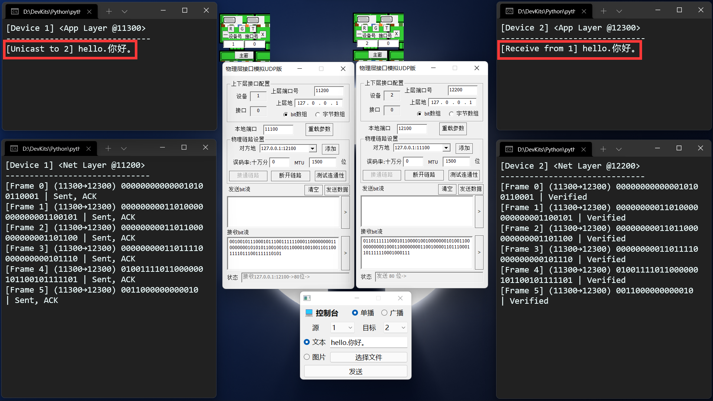

可以看到，双方应用层能够正确编解码，最终在设备2呈现出原本、完整的字符串。由此可以说，我们成功实现了Unicode字符的I/O。

#### 5.8.2 文本传输容量

根据指导书要求，双方至少需要支持50个中英文字符的传输。于是在本测试中，我们从设备1向设备2发送文本“abcd...zabcd...z”，即两遍字母表（52个英文字符）。

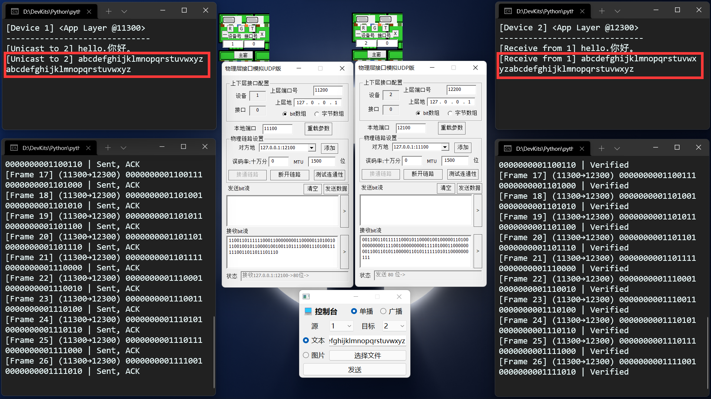

可以看到，设备1成功收到了这一字符串。由此可以说，我们成功实现了指导书的文本传输容量需求；并且在理论上，这一容量是没有上限的，因为我们物理层单次发送的数据远小于MTU限制。接下来的图片I/O测试，也能侧面反映这一点。

#### 5.8.3 图片I/O

在本测试中，我们从设备1向设备2发送图片“test.png”。由于我们平时生活中的图片大多都有上百万位比特，测试耗时实在过长，所以我们自行绘制了一幅4*4像素的微型图片，用于简单测试图片传输效果。

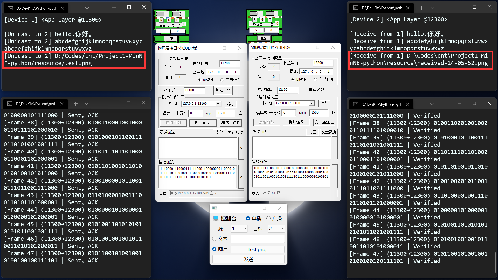

可以看到，图片成功地以比特流形式从一端传到了另一端，并提示保存在了/resource目录下。打开目录，我们可以发现一张一模一样的图片“received-XX-XX-XX.png”，这就是接收端收到的图片。


由此可以说，我们成功实现了小型图片的I/O，但中、大型图片的I/O需要性能的进一步优化（尤其是差错控制协议的优化），来加速比特流的传输。

#### 5.8.4 检错与差控

在本测试中，我们设置两边的物理层误码率为十万分之1000（1%），从设备1向设备2发送文本“差控重传测试”。


可以看到，传输过程中出现了多次超时、负确认、乱码等情形；但通过双方网络层的检错与差控，接收端应用层最终能够呈现出正确、完整的字符。由此可以说，我们成功实现了CRC-16校验、停等协议这两个基本的方法。

#### 5.8.5 Keepalive机制

在本测试中，我们设置两边的物理层误码率为十万分之10000（10%），来模拟恶劣的信道环境；然后从设备1向设备2发送“Keepalive测试”。


在收发双方多次的超时过后，双方都触发了Keepalive机制，停止了收发过程。

然后，我们再将误码率恢复为0，重新发送“Keepalive测试”；此时接收端可以正常地接收消息，就好像没有触发过Keepalive机制一样。


由此可以说，我们实现了简单的Keepalive机制。

#### 5.8.6 各项性能指标

##### 5.8.6.1 吞吐量

在本测试中，我们会以比特速率（bps）来衡量系统的性能。每次测试会在不同误码率下，发送信息“helloworld”，然后由网络层计算出每次发送的网速；如果接收端成功接收，就记录下这次的网速。

两边的物理层误码率从0到1%，每0.1%为一档，每档测试3次取平均值。使用`Python+Matplotlib`绘制出测试结果曲线如下：


在信道环境良好的情况下，吞吐量最高可以达到4500bps左右；随着误码率提高，吞吐量总体呈下降趋势。

##### 5.8.6.2 误码承受能力

在本测试中，我们将测试系统对误码的承受能力。我们将逐步提高误码率，步进0.5%；当连续3次触发双方的Keepalive机制时，则认为系统达到误码承受能力上限。测试结果如下表：

|   误码率    |    发送端     |    接收端     |
| :---------: | :-----------: | :-----------: |
|  $0-3.0\%$  |   成功发送    |   成功接收    |
| $\ge 3.5\%$ | 触发Keepalive | 触发Keepalive |

由此可以说，该系统对误码的承受能力在3.5%左右；高于3.5%时，用户需要等待信道恢复良好，再重新输入消息。

##### 5.8.6.3 传输延时

在本测试中，我们从设备1向设备2发送文本“hi”，通过网络层显示的时间信息测算传输延时。记$t_1$为发送端发送第一帧到接收端接收第一帧的间隔，$t_2$为接收端发送最后一帧回复到发送端接收最后一帧回复的间隔。

4次测试中，$t_1$平均值为76.75ms，$t_2$平均值为33.75ms。这一数值显然并不令人满意，我们推测主要是停等协议造成的，因为等待接收端回复的时间实在白白浪费了太多时间。

#### 5.8.7 心得与反思

通过阶段二的程序编写，我们深入了解了网络层（与数据链路层）各种功能的基本原理，同时对停等协议下双端的交互时序有了深刻的体会。

我们的主机网络层仍存在不尽人意之处，例如停等协议实在太简单粗暴，大大限制了发送与接收的速度；流量控制也较为简陋，不能根据网路状态进行自适应。

## 六、交换机网络层

在网络中，交换机负责在多个主机间交换信息，从而让广播成为可能，同时也减少了P2P通路的数量。它主要有两种功能：

- 维护端口地址表
- 单播广播支持

下面我们将分别展示这两种功能。

### 6.1 维护端口地址表

对于主机而言，它的信息只有一条路可走——就是发到自己的物理层，然后交给交换机。但对于交换机而言，它的信息有不止一条路可走。

直接广播给所有端口然后让它们自行判收，显然是浪费信道资源的一种做法，我们更希望交换机自己能够记住，发给谁的信息要走哪个端口。这就需要它内部维护一张对照表，将本地自己的物理层端口与远程其他主机的应用层端口联系起来。

同时，端口地址表，在高误码率情况下，有可能记录错误的端口；我们还希望端口地址表能够自行清理这些错误的端口。这就需要交换机为每个端口设置一个生存周期，当端口过期，就自动清除它。

我们使用`collection.defaultdict`类型对此进行管理。使用`JSON`描述端口地址表内部数据如下：

```JSON
{
  "14100": {      // 交换机的物理层14100。
    "11300": 100,   // 从这个端口可以去往应用层11300，当前寿命为100。
    "65535": -1   // 广播端口65535的寿命无限。
  },
  "14101": {      // 交换机的物理层14101。
    "12300": 99,   // 从这个端口可以去往应用层12300，当前寿命为99。
    "65535": -1   // 广播端口65535的寿命无限。
  },
  "14102": {      // 交换机的物理层14102。
    "13300": 57,   // 从这个端口可以去往应用层13300，当前寿命为57。
    "65535": -1   // 广播端口65535的寿命无限。
  }
}
```

在主程序中，每一次交换机接收到信息，它都会：

1. 刷新一次端口地址表，剔除过期的端口，同时反向学习；
2. 根据发来的帧的目的端口进行查询，看要发到哪个物理层端口。

我们在`SwitchLayer`类中封装了这两个方法，分别是：

- `update()`：上述任务1；
- `search_locals()`：上述任务2。

具体代码实现逻辑较复杂，不在此叙述，源文件内有详细注释。

### 6.2 单播广播支持

为了实现对单播广播的支持，交换机需要截获并读取帧，判断帧内消息发送的形式（单播或广播），然后据此采取相应的行动。

- 如果是单播消息，就在端口地址表中查询应该送到哪个端口；
  - 如果查到了，就发向这个端口；
  - 如果没找到，就发向各个物理层，接收端回复时就能反向学习了；
- 如果是广播消息，就直接发向各个物理层。

### 6.3 代码框架

将以上的两部分结合起来，就是交换机网络层的代码框架。

```Python
while True:
  wait_until_message_comes()
  receive_message()

  update()
  search_where_should_I_send_this_frame()

  if search_success:
    unicast_to_this_port()
  else:
    broadcast_to_every_port()
```

### 6.4 阶段三测试

根据上面的代码框架，我们在阶段三写出了交换机网络层，并在交换机下接入了多台主机，在这些网元间进行了测试。下面是阶段三的拓扑。

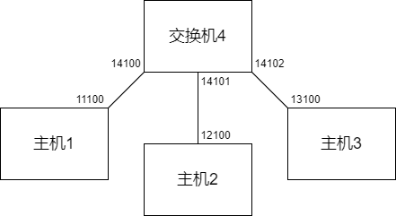

测试结果如下。

#### 6.4.1 单播支持

在测试中，我们从设备1向设备2单播文本“HelloHost2”。

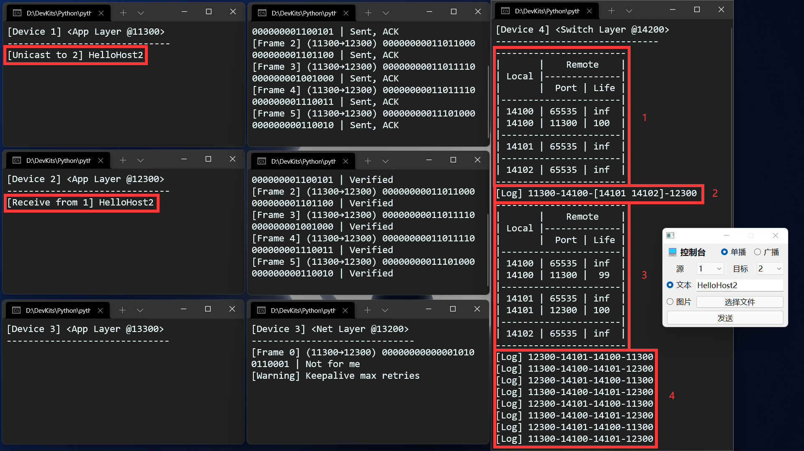

可以看到，交换机能够正确的学习并更新端口地址表，并充当两主机发送、回复、重传的桥梁，消息最终完好地传递到了设备1。

由于我们不向设备3传输消息，所以设备3网络层虽然接收到了消息，但并没有向应用层递交。由此可以说，我们成功实现了单播地址判收。

同时，我们对交换机实际表现出的行为作如下分析：

1. 交换机从14100收到一个包，它读取包得知源端口号为11300。此时端口地址表内还没有14100-11300的关系，于是它将其加入表内；
2. 交换机读取包得知目标端口号为12300，但此时它还不知道要到12300该从哪里走，所以它向14101、14102广播了这个包；
3. 交换机从14101收到一个包，它读取包得知源端口号为12300。此时端口地址表内还没有14101-12300的关系，于是它将其加入表内；
4. 交换机读取包得知目标端口号为11300，此时它的表内已经有14100-11300的关系，所以它直接向14100单播了这个包；之后的过程中，交换机已经完全学会了两边的关系，所以全部都是单播。

这与我们在[6.2节](#62-单播广播支持)中的理论分析完全一致。由此我们可以说，我们成功实现了交换机的单播功能与反向学习。

#### 6.4.2 广播支持

在测试中，我们从设备3向所有设备广播文本“Hello1and2”。


我们同样对交换机表现出的行为作如下分析：

1. 在设备3发送时，交换机能够正确识别出这是广播消息，并广播给设备1和2；
2. 在设备1和2回复时，交换机也能够正确识别出这是单播消息，并单播给设备3。

最终，消息完好地传递到了所有设备。由此我们可以说，我们成功实现了交换机的广播功能。

#### 6.4.3 各项性能指标

##### 6.4.3.1 吞吐量

测试方法与[阶段二相应测试](#5861-吞吐量)基本一致，但本次测试调整的是交换机两个物理层端口的误码率，从0到1%，每0.1%为一档。同样绘制曲线如下：

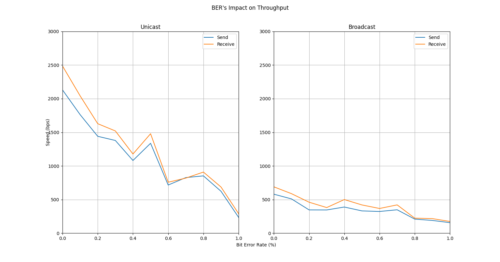

在信道环境优质的情况下，单播吞吐量最高可以达到2500bps左右；广播吞吐量在600bps左右；随着误码率提高，吞吐量总体呈下降趋势。

这一现象显然有其合理性：加入交换机后，消息的传输过程就额外增加了交换机解包、查表的时间开销；其传输时间必然多于无交换机的情况。又由于广播的最后一帧必然要等待完整的一段超时时间，所以广播的性能受了很大的约束。

##### 6.4.3.2 误码承受能力

测试方法与[阶段二相应测试](#5862-误码承受能力)基本一致，但本次测试调整的是交换机两个物理层端口的误码率。测试结果如下表：

|   误码率    |    发送端     |    接收端     |
| :---------: | :-----------: | :-----------: |
|  $0-3.0\%$  |   成功发送    |   成功接收    |
| $\ge 3.5\%$ | 触发Keepalive | 触发Keepalive |

由此我们可以说，该系统对误码的承受能力在3.5%左右，这与无交换机时一致；高于3.5%时，用户需要等待信道恢复良好时，再重新输入消息。

这一现象亦有其合理性：交换机做的只是简单的消息转发，而并不对消息本身做任何更改；而改变误码率的物理层，和阶段二一样，只有两处，所以其误码承受能力理应没有太大变化。

##### 6.4.3.3 传输延时

测试方法与[阶段二相应测试](#5863-传输延时)基本一致。

对于单播，我们测试了3次，$t_1$平均为99ms，$t_2$平均为42ms，相比于阶段二均有所延长。

对于广播，我们测试了3次，$t_1$平均为152ms，$t_2$平均为182ms，相比于阶段二大幅延长。

这一大幅延长亦有其合理性：第一，发送端需要接收来自多方的回复，而每一次都是采用停等协议这一笨重的方法；第二，在接收完所有回复后，发送端还必须等待一次超时时间，来保证回复全部接收。这导致了广播耗时的大幅增加。

#### 6.4.4 心得与反思

通过阶段三的程序编写，我们对端口地址表的实现有了深刻的体会，同时也了解了“反向学习”，这一个初听神秘、现在熟知的功能。同时，我们也在编写广播功能的同时，认识到了广播风暴的根源。

同时我们也清楚，我们的交换机只适用于最简单的拓扑网络；由于我们并没有实现生成树算法，我们的交换机无法应对环形拓扑的死循环症状。因此，我们的交换机只适用于简单的拓扑结构，而不能适应环形交换机拓扑。这是我们程序的一大问题。

## 七、路由器网络层

相比起交换机，路由器有更全局的视野、更智能的实体；交换机解决不了的投递定向问题，路由器可以解决。在整个网络中，路由器主要有两种功能：

- 维护路由表
- 数据定向投递

下面将依次展示这两种功能。

### 7.1 路由表

路由表是路由器的核心所在：后者正是依靠对前者的不断更新与维护，才能做到对网络全局的把控、对数据包的精准投递。

我们采用**链路状态算法**来维护路由表。

#### 7.1.1 基本原理

链路状态算法主要采用**链路延时**作为衡量链路状态的标准：链路的延时越高，意味着“走这条路到达别的路由器的代价”就越高。每台路由器只关心自己周围的链路状态，据此更新自己的路由表，然后将自己的路由表扩散到全网的路由器。

当路由器接收到来自其它路由器的路由表时，它会采用**Dijkstra算法**计算出到达全网各点的最佳路径，即“费用最低”的路径。具体实现如下：

1. 一开始，只记录相邻链路的费用，而认为其它所有节点的费用均为无穷；
2. 选择路由表中费用最低的路径P，将其标记为“最优化”，不再对其进行更新；
3. 接收P的终点路由器T的路由表，然后在此基础上，判断“先走T，再走T的邻路”是否能让自己更快地到达T的邻居。如果是，则更新自己的路由表；
4. 重复2、3，直到路由表中的每一条路径都被标记为“最优化”。

#### 7.1.2 代码实现

我们将`Dijkstra`算法等重要函数封装在了`RouterTable`类内；路由表通过`merge()`函数即可迅速实现本地路由表与新路由表的合并。对于路由器间的信息交互，我们设置了`pack()`和`unpack()`函数，以便捷地打包、解包路由表。具体代码见`layer/router.py`。

### 7.2 数据定向投递

我们常说，路由表“划分了广播域”，所有的广播消息都不会穿过路由器。这一叙述的实际含义就在于，路由器总是知道帧的目的地在哪里、应该投递给谁；而不会像交换机那样，遇到不认识的端口就直接广播。

#### 7.2.1 基本原理

在实际的生活中，寻址是通过ARP（地址解析协议）完成的，它能够将IP地址映射到MAC地址。但由于本项目的网络拓扑模型较小，且限于本机套接字间通信，加之物理层模拟软件限制了端口号各位的意义，我们可以——并且也只能——自定义一种映射方案来简化这一过程。方案如下：

- 端口号定义：
  - 第1位统一为`1`；
  - 第2位为设备号；
  - 第3位为层次号：应用层为`3`，网络层为`2`，物理层为`1`；
  - 第4-5位为实体号，从`00`开始编号。

> 例如，设备2的物理层实体3的端口号为`12103`。

- 路由器寻址：
  - 记任意类型设备m的设备号为$D_m$，路由器i的设备号为$R_i$，交换机j的设备号为$S_j$，主机k的设备号为$H_k$。定义$D_s\in D_t$为“设备s隶属于设备t”。
  - $k<j,\forall H_k\in S_j$
  - $k_1<k_2,\forall H_{k_1}\in S_{j_1},H_{k_2}\in S_{j_2},j_1<j_2$
  - $j<i,\forall S_j,H_k\in R_i$
  - $j_1<j_2,\forall S_{j_1}\in R_{i_1},S_{j_2}\in R_{i_2},i_1<i_2$

> 即，对于任意一台有上级的设备A，其上级B的设备号必然大于A；但是在这一前提下，所有可能成为A上级的设备中，B的设备号是最小的。

- 投递过程：
  - 用户指定设备号，而非端口号；
  - 网元将目的设备号映射为目的应用层端口号。

> 例如，用户指定向设备4投递消息，则网元将其映射为14300。

#### 7.2.2 代码实现

这一映射与反映射需要主机应用层和路由器网络层的共同努力。我们在`AppLayer`类内封装了`_get_dst_from_user()`方法，支持设备号到端口号的映射；在`RouterLayer`类内封装了`search()`方法，支持端口号到设备号的反映射。具体代码见`layer/app.py`和`layer/router.py`。

### 7.3 代码框架

```Python
while True:
  broadcast_table_at_regular_interval()
  wait_message()
  receive_message()

  if is_for_me:
    merge_this_table()

  else:
    search_exit()
    if no_result or should_send_to_incoming_port:
      continue
    else:
      send_frame_to_this_exit()
```

### 7.4 阶段四调试

根据上面的代码框架，我们在阶段四写出了路由器网络层，并建立了混合组网拓扑，实现了不同子网的主机交互。下面是阶段四的拓扑。

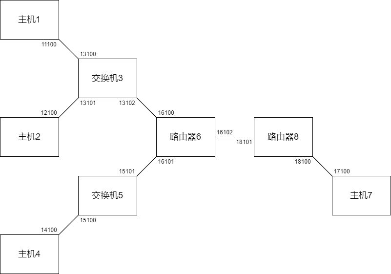

测试结果如下。

#### 7.4.1 路由表计算

在本测试中，为了测试我们编写的路由表在拥有较多路由器的拓扑网络中的表现，我们另外编写了一套拓扑配置，拓扑图如下：


我们只导入路由表类（RouterTable），进行不依赖套接字的测试。测试结果如下：

|                                   |                                   |
| :-------------------------------: | :-------------------------------: |
|  |  |
|  | 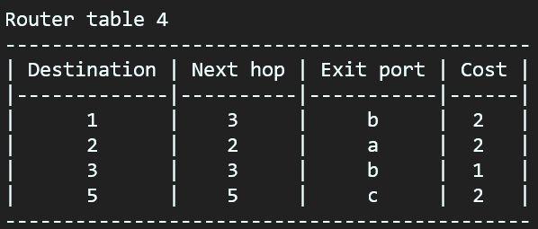 |
| 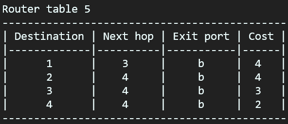 |                                   |

对照拓扑图，我们很容易验证其正确性。由此可以说，我们成功实现了路由表的计算与合并更新。

#### 7.4.2 跨网单播

在本测试中，我们将测试不同子网下的主机间能否正常通信。我们从隶属于路由器6的设备1，向隶属于路由器8的设备7发送文本“HelloHost7”。

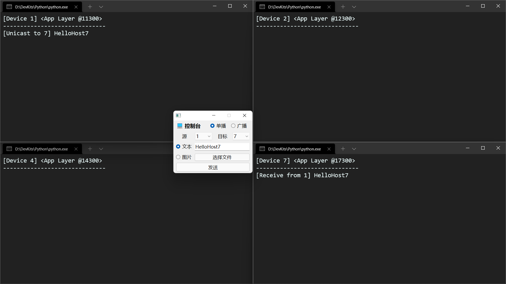

由于终端数量过多，我们只展示各主机的应用层。可以看到，设备7正确地接收到了来自设备1的消息。由此可以说，我们成功实现了路由器的跨网单播；同时也不难知道，我们的端口映射方案也是成功的。

#### 7.4.3 局域网广播

在本测试中，我们将测试主机能否对局域网内主机进行广播。我们从设备2向路由器6下的所有设备发送文本“HelloEveryone”。

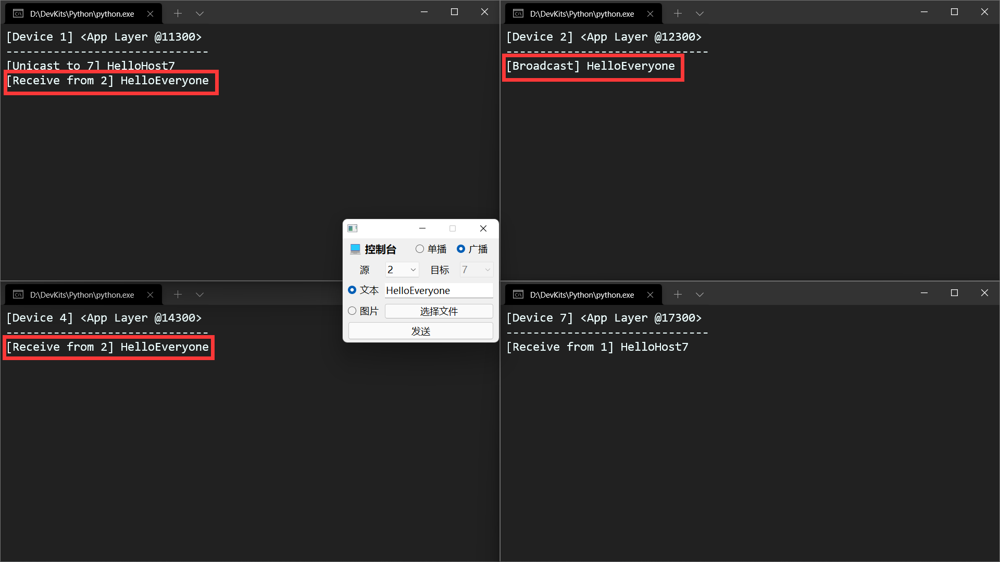

可以看到，同属于路由器6下的主机1和4都收到了广播消息；而主机7由于不属于该局域网，并没有收到任何消息。由此可以说，我们成功实现了路由器的局域网广播。

#### 7.4.4 各项性能指标

##### 7.4.4.1 吞吐量

测试方法与[阶段三相应测试](#6431-吞吐量)基本一致，但本次测试调整的是路由器对应两主机的出口物理层的误码率，从0到1%，每0.1%为一档。同样绘制曲线如下：

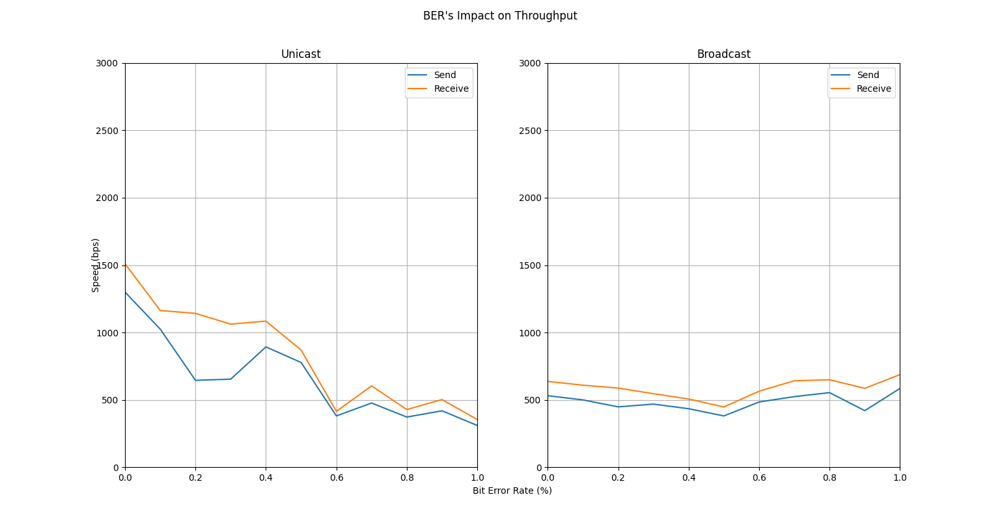

在信道环境优质的情况下，单播吞吐量最高可以达到1400bps左右，随着误码率提高，吞吐量总体呈下降趋势；广播吞吐量在500bps左右，基本维持不变，推测原因为测试次数较少，偶然性较强。

##### 7.4.4.2 误码承受能力

测试方法与[阶段三相应测试](#6432-误码承受能力)基本一致，但本次测试调整的是路由器对应两主机的出口物理层的误码率。测试结果如下表：

|   误码率    |    发送端     |    接收端     |
| :---------: | :-----------: | :-----------: |
|  $0-2.0\%$  |   成功发送    |   成功接收    |
| $\ge 2.5\%$ | 触发Keepalive | 触发Keepalive |

由此我们可以说，该系统对误码的承受能力在2.5%左右；高于2.5%时，用户需要等待信道恢复良好时，再重新输入消息。

相较于阶段三，加入路由器后的误码承受能力下降，我们组推测其原因是，路由器增加了端到端的延时，本来可以到达另一端的消息因为该延时被误判为超时，于是白白增加了超时的次数。

##### 7.4.4.3 传输延时

测试方法与[阶段三相应测试](#6433-传输延时)基本一致。

对于单播，我们测试了3次，$t_1$平均为167ms，$t_2$平均为47ms，相比于阶段三均有所延长。

对于广播，我们测试了3次，$t_1$平均为209ms，$t_2$平均为390.3ms，相比于阶段三大幅延长。

#### 7.4.5 心得与反思

通过对阶段四的程序编写，我们组对链路状态路由表的计算算法有了深入的了解与实践，对路由表交换信息的方式有了基本的了解，同时也明白了构建好的拓扑图、映射关系的重要性。

同时，我们的阶段四程序并不很令人满意。虽然我们能够实现跨网单播、内网广播等基本功能，但我们的路由表做的过于简陋，主要表现为以下两点：

- 没有通过测算链路延时，来计算链路状态，而是将链路状态（费用）设置为一个固定值；
- 只编写了路由表扩散与接收的函数，但没有真正实现与其它路由器的交流。

因此，我们的路由器其实并没有做到完全的链路状态算法，只是能够算出全网的拓扑与费用而已，但实际上是静态的。这是我们阶段四最大的遗憾。

同时，我们也发现我们的流控超时时间存在一定的瑕疵：虽然在应用层上，我们的确能完整地收到消息，但翻阅网络层的日志，我们发现存在着许多不该出现的超时与乱序，这需要我们对超时参数进行进一步的调整。

## 八、总结

### 8.1 指导书需求完成情况

综上所述，我们组编写的网元系统能够完成指导书上的基本要求，以及部分进阶要求，具体列出如下：

- 阶段一
  - [x] 随机数产生与应答
- 阶段二
  - 基本要求
    - [x] 帧同步与定位：面向位的首尾定界法
    - [x] 差错检测：CRC-16校验码
    - [x] 差错控制协议：停等协议
    - [x] 流量控制：睡眠固定时间
    - [x] 性能测试：误码率-吞吐量曲线
  - 进阶要求
    - [ ] 端到端差错控制协议
    - [ ] 面向连接协议
    - [ ] 有测量计算的流量控制
    - [x] 分帧：帧封装，单次传输约100位信息
    - [x] 多角度性能测试：误码承受能力、延时
    - [x] 其它相关：Keepalive机制、模块化编程
- 阶段三
  - 基本要求
    - [x] 单播目的地址判收：成功实现
    - [x] 支持广播：成功实现
    - [x] 有端口地址表：成功实现
    - [x] 反向地址学习：成功实现
    - [x] 性能测试：误码率-吞吐量曲线、误码承受能力、延时
  - 进阶要求
    - [x] 环形交换机拓扑效果：广播死循环
    - [ ] 生成树算法
    - [x] 友好的应用层：界面简约美观，只展示必要信息
    - [x] 其它相关：端口地址表引入老化过期机制
- 阶段四
  - 基本要求
    - [x] 实体编址：成功实现
    - [x] 路由表：成功实现
    - [x] 按路由转发：成功实现
    - [x] 端到端信息交换：成功实现单播、广播
    - [x] 性能测试：误码率-吞吐量曲线、延时
  - 进阶要求
    - [ ] 相互独立的地址映射技术
    - [ ] 动态路由算法：只实现了`Dijkstra`算法，但不交流
    - [x] 多种多层网元体系完整：建立了混合组网拓扑
    - [x] 多角度性能测试：误码承受能力
    - [x] 应用层图形化界面
    - [x] 统一友好的观测平台

### 8.2 项目心得体会

该项目是课程四个项目中最难的一个，它涵盖了课程中的许多知识点：定位、检错、差控、流控、共享、交换、路由、转发、广播……但相应地，它也是给我们小组最多收获的一个。

通过这一项目，我们小组真正地将课堂所学的内容，应用到了实际的编程当中，并且也对这门课程的授课大纲有了更深层次的把握。我们不再只是知识的接收者，而是成为设计者，通过实操真正理解了为什么、怎么样；也因此，我们的专业知识水平、程序设计水平、团队合作水平得到了极大的提高。

在最初，我们小组采用的语言是C++，但我们在阶段四遇到了无法解决的困难，项目进度也一度停滞；最后我们不得不做出一个艰难的决定：转向Python。仓促之下，我们并没有对具体的算法做进一步的打磨，也自知我们的代码仍留下了不少遗憾。然而，虽然我们小组并没有能够将代码写得十全十美、令人满意，但这一项目给我们的收获——不管是通信方面还是编程方面——我们认为，是远远超过代码本身的。

感谢老师们在我们组项目推进的过程中，提供的悉心教导与陪伴！

## 九、附录

### 9.1 编写与运行环境

- OS: Windows 11
- IDE: Microsoft Visual Studio Code
- Python version: 3.9.7 64-bit

> Minimum version 3.7 required, 3.9 or higher recommended.

### 9.2 项目开源地址

https://github.com/MrCaiDev/cnt
