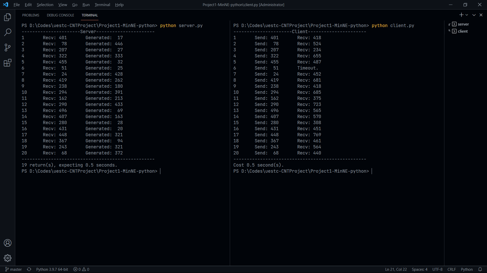
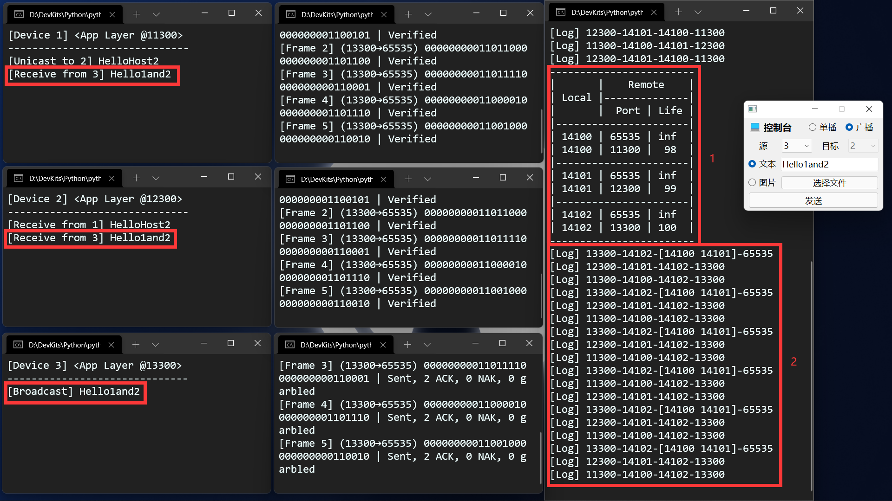
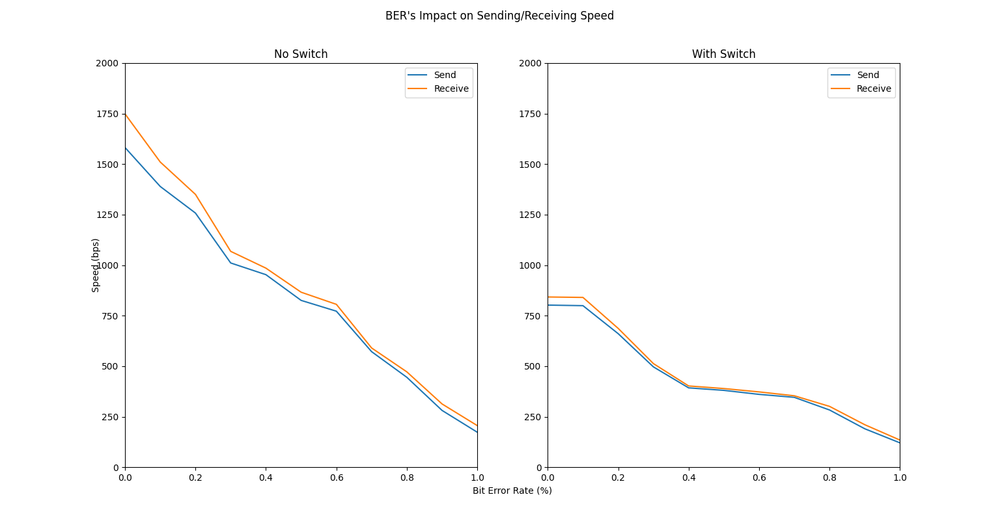

# 项目一阶段三报告

> 蔡与望 2020010801024 程序的架构、编写与调试，报告的撰写
>
> 党一琨 2020140903010 网元与帧的设计
>
> 郭培琪 2020030701003 重要函数的设计
>
> 陶砚青 2020040401013 程序的调试与debug

- [项目一阶段三报告](#项目一阶段三报告)
  - [一、整体架构](#一整体架构)
    - [1.1 网络拓扑](#11-网络拓扑)
    - [1.2 帧结构](#12-帧结构)
    - [1.3 代码目录结构](#13-代码目录结构)
  - [二、应用层](#二应用层)
    - [2.1 决定网元模式](#21-决定网元模式)
    - [2.2 信息I/O](#22-信息io)
    - [2.3 编解码](#23-编解码)
    - [2.4 代码框架](#24-代码框架)
    - [2.5 阶段一调试](#25-阶段一调试)
  - [三、网络层（主机）](#三网络层主机)
    - [3.1 帧的结构](#31-帧的结构)
    - [3.2 帧同步与定位](#32-帧同步与定位)
      - [3.2.1 基本原理](#321-基本原理)
      - [3.2.2 代码实现](#322-代码实现)
    - [3.3 地址读写](#33-地址读写)
      - [3.3.1 取16位的原因](#331-取16位的原因)
      - [3.3.2 代码实现](#332-代码实现)
    - [3.4 序号读写](#34-序号读写)
      - [3.4.1 取8位的原因](#341-取8位的原因)
      - [3.4.2 代码实现](#342-代码实现)
    - [3.5 差错检测](#35-差错检测)
      - [3.5.1 基本原理](#351-基本原理)
      - [3.5.2 代码实现](#352-代码实现)
    - [3.6 差错控制](#36-差错控制)
      - [3.6.1 基本原理](#361-基本原理)
      - [3.6.2 采用停等协议的原因](#362-采用停等协议的原因)
      - [3.6.3 Keepalive机制](#363-keepalive机制)
      - [3.6.4 代码实现](#364-代码实现)
    - [3.7 流量控制](#37-流量控制)
      - [3.7.1 基本原理](#371-基本原理)
      - [3.7.2 代码实现](#372-代码实现)
    - [3.8 代码框架](#38-代码框架)
    - [3.9 阶段二调试](#39-阶段二调试)
      - [3.9.1 Unicode字符的I/O](#391-unicode字符的io)
      - [3.9.2 差错的检测与重传](#392-差错的检测与重传)
      - [3.9.3 Keepalive机制的触发](#393-keepalive机制的触发)
      - [3.9.4 吞吐量测试](#394-吞吐量测试)
  - [四、网络层（交换机）](#四网络层交换机)
    - [4.1 监听各端口消息](#41-监听各端口消息)
    - [4.2 维护端口地址表](#42-维护端口地址表)
    - [4.3 多主机信息交换](#43-多主机信息交换)
    - [4.4 代码框架](#44-代码框架)
    - [4.5 阶段三调试](#45-阶段三调试)
      - [4.5.1 单播的支持](#451-单播的支持)
      - [4.5.2 广播的支持](#452-广播的支持)
      - [4.5.3 吞吐量测试](#453-吞吐量测试)
    - [4.6 反思、总结与心得](#46-反思总结与心得)
  - [五、网络层（路由器）](#五网络层路由器)

## 一、整体架构

### 1.1 网络拓扑


我们的网络拓扑模型共设有7个网元：1台路由器、2台交换机、4台主机。各网元间形成**树形拓扑**，通过课程提供的物理层模拟软件进行互联。

主机的网元分为三层，分别是**应用层、网络层与物理层**；而路由器与交换机，由于不需要与用户进行I/O操作，不设应用层。各层间通过（手动或自动）设定的端口进行通信。

网元各层的主要功能如下：

- 应用层
  - 决定网元模式
  - 信息I/O
  - 编解码
- 网络层（主机）
  - 帧同步与定位
  - 地址读写
  - 序号读写
  - 差错检测
  - 差错控制
  - 流量控制
- 网络层（交换机）
  - 监听各端口消息
  - 维护端口地址表
  - 多主机信息交换
- 物理层
  - 连接起各网元
  - 模拟误码
  - 模拟MTU
  - 添加时钟信号等冗余位

### 1.2 帧结构

在我们的设计中，网元间以帧为单位交换信息；帧内除了用户发送的数据，还有网络层添加的各种控制信息，用于实现差控、流控、判收等功能。


上图是我们组设计的帧结构。它包括以下这几部分：

- 帧头、帧尾（8位）
- 源地址、目的地址（16位）
- 帧序号（8位）
- 数据（32位，只能少不能多）
- CRC校验码（16位）
- 冗余（位数不等，帧同步的副产物）

具体每一部分的功能、原理与实现见第3章。

### 1.3 代码目录结构

程序使用`Python`编写。

```txt
Project
├─ OneTouchToGo.bat           一键启动所有网元
├─ OneTouchToClose.bat        一键关闭所有网元
├─ bin                        可执行文件存储目录
│    └─ phy.exe               物理层
├─ ne.txt                     物理层配置文件
└─ src                        源文件存储目录
       ├─ app.py              应用层（主机）
       ├─ net.py              网络层（主机）
       ├─ switch.py           网络层（交换机）
       └─ utils               自定义模块
              ├─ __init__.py  模块生成
              ├─ coding.py    编解码函数
              ├─ constant.py  常数
              ├─ frame.py     帧封装
              └─ layer.py     层封装
```

## 二、应用层

在整个网元中，应用层主要承担着三部分职责：

- 决定网元模式
  - 控制整个网元处于接收还是发送模式。
- 信息I/O
  - 发送端：读取用户想传输的消息；
  - 接收端：输出用户可辨识的消息。
- 编解码
  - 发送端：Unicode字符→01字符串；
  - 接收端：01字符串→Unicode字符。

下面将分别展示这三种功能。

### 2.1 决定网元模式

由于技术限制，本项目中的网元是半双工模式，即同时只能处于收/发状态中的一种。这一选择将通过用户手动输入来激活，然后应用层负责将用户的选择通知到整个网元。整体的逻辑如下。

```Python
while True:
  mode = input()

  if mode == QUIT:
    break

  elif mode == RECV:
    enter_receive_mode()

  elif mode == UNICAST:
    enter_unicast_mode()

  elif mode == BROADCAST:
    enter_broadcast_mode()

  else:
    give_alert()
```

### 2.2 信息I/O

为了操作的便利，本项目中将使用`str`类型，进行绝大部分信息的操作。相应地，信息的I/O只需要调用`print()`就能够实现。

### 2.3 编解码

由于项目需要提供对中文I/O的支持，所以显然ASCII码无法满足项目的需求，而是需要**针对Unicode字符设计编解码方案**。设计流程如下：


具体代码可以在`utils/coding.py`中找到，该模块留下6个API供外部调用：

- `dec_to_bin()`：将十进制数转化为01字符串；
- `bin_to_dec()`：将01字符串转化为十进制数；
- `string_to_bits()`：将01字符串转化为01比特流；
- `bits_to_string()`：将01比特流转化为01字符串；
- `encode()`：将Unicode字符串编码为01字符串；
- `decode()`：将01字符串解码为Unicode字符串。

### 2.4 代码框架

细化[2.1节](#21-决定网元模式)的逻辑后，我们很容易得出应用层的代码框架：

```Python
while True:
  mode = input_valid_mode()

  if mode == QUIT:
    break

  elif mode == RECV:
    receive_message()
    continue

  elif mode == UNICAST:
    input_valid_port()

  # 单播只比广播多一步获取目的端口，发送代码可以合并。
  send_message()
```

### 2.5 阶段一调试

为了给接下来的阶段做铺垫，我们需要先写两个简单的应用层，对网元间通信的方式、网元工作的模式有一定的理解。对于项目指导书中的需求，下面是我们测试的结果。

> 项目需求：
> 客户端定时每500ms向服务器发送一个随机整数，范围在1~500之间；
> 服务器每收到一份数据也同时产生随机整数与收到的数据相加，只有在结果大于100时才会把计算结果返回给客户端，而客户端收到超出100的结果则立即产生一个新的数据，而不是在间隔500ms后。
> 客户机需要产生20份数据，如果有超过100的结果，总运行时间应接近10-N*0.5，N为超过100的结果的数量。



可以看到，服务端与客户端之间能够进行稳定的通信，客户端通过`select()`实现了超时的判断，实际运行时间与预期时间（10-N*0.5）相符。

通过这个程序，我们了解了控制超时的两种方法：`settimeout()`和`select()`，同时也知道如何基于不同事件做出不同的响应，对网元间通信的形式、时序等有了进一步了解。

## 三、网络层（主机）

在整个网元中，网络层（主机）的功能最多、最重要，主要分为六部分：

- 帧同步与定位
  - 发送端：让接收端在杂乱的01序列中，找到有用的信息。
- 地址读写
  - 发送端：写入源、目的地址，用于交换、路由的实现；
  - 接收端：读取源、目的地址，知道信息从哪来、是不是给自己的。
- 序号读写
  - 双端：防止传送时的帧间乱序，也用于差错控制协议的实现；
- 差错检测
  - 接收端：检查信息有没有传错，如果出错就要求重传。
- 差错控制
  - 发送端：如何实现某一帧的重传；
  - 接收端：如何让发送端知道要不要重传。
- 流量控制
  - 双端：防止自己发得太快，导致网络来不及处理、对方来不及读取……等后果。

下面我们将先展示帧的结构，然后分别展示这六种功能。

### 3.1 帧的结构

为了方便对帧的各部分进行操作，我们利用`Python`“面向对象”的特点，将帧封装为一个类，下面是这个类的结构。

```Python
class Frame:
  def __init__(self):
    """初始化帧属性。"""
    pass

  def __str__(self):
    """打印帧信息。"""
    pass

  @property
  def some_property(self):
    """将帧的某一属性设为只读。"""
    pass

  def write(self, ...):
    """将信息写入帧。"""
    pass

  def read(self, ...):
    """将01序列解析为帧。"""
    pass

  def __extract_message(...):
    """帧定位与反变换。"""
    pass

  def __add_locator(...):
    """帧同步。"""
    pass

  def __generate_crc(...):
    """生成CRC校验码。"""
    pass

  def calc_frame_num(...):
    """计算消息需要分多少帧发送。"""
    pass
```

通过封装帧，我们可以直接对01序列进行读写，这也使得网络层代码的描述性、可读性变得更强，逻辑更加清晰。具体的代码可以在`utils/frame.py`中找到。

### 3.2 帧同步与定位

采用**面向位的首尾定界法**。

#### 3.2.1 基本原理

- 发送端：变换，添加帧头帧尾。
  1. 在一帧的首尾加上`0111 1110`，以标识帧的始末位置；
  2. 帧内的信息也有可能出现`0111 1110`的序列，所以为了防止接收端把帧内信息误当作帧尾，发送端还要在帧内的每个`11111`后面插一个`0`，以免帧内出现`0111 1110`子序列。

- 接收端：找到帧头，反变换。

  1. 在物理层收到的乱码中，找到帧头`0111 1110`，然后把帧头剥落；
  2. 对于接下来出现的每个`11111`子序列：
     1. 如果接下来出现的是`0`，那这个`0`肯定是发送端插的，删掉还原。
     2. 如果接下来出现的是`1`，那这就是帧尾`0111 1110`。（因为发送方已经保证了帧内不可能出现连续6个`1`。）

#### 3.2.2 代码实现

我们在`Frame`类内添加了两个私有静态方法，实现帧同步与定位功能：

- `__add_locator()`：实现上述发送端的任务，在写入信息时调用；
- `__extract_message()`：实现上述接收端的任务，在读入信息时调用。

具体的代码可以在`utils/frame.py`的`Frame`类中找到。

### 3.3 地址读写

采用**16位二进制数**标识地址。

#### 3.3.1 取16位的原因

由于本项目的网元间通信只在本机（127.0.0.1）实现，所以只需要封装源与目的地的端口即可。又因为端口范围是0~65535，所以每个端口需要用16位二进制表示。

#### 3.3.2 代码实现

发送端只需要使用简单的`f-string`字符串拼接，即可把地址写入帧；接收端也只需要用字符串切片，就可以提取地址信息。不再展开叙述。

### 3.4 序号读写

采用**8位二进制数**标识序号。

#### 3.4.1 取8位的原因

项目需求提出，传输数据上限约50个字符；又根据[2.3节](#23-编解码)得出的结论：一个字符为16位，所以一段消息最多有800位。

一帧最多传输32位数据，所以一段消息最多要用25帧，才能传输完毕。

又为了CRC码在代码实现上的便利（见[3.5节](#35-差错检测)），序号位数需要是4的倍数；于是我们可以选择4位或8位，即0~15或0~255。我们想要为单次发送过程中的每一帧都标上独特序号，加之4位的开销也并不算很大，所以采用了8位序号。

#### 3.4.2 代码实现

序号读写与地址读写相似，只需要简单的拼接和切片即可实现。不再展开叙述。

### 3.5 差错检测

采用**CRC-16校验码**，不纠错。

#### 3.5.1 基本原理

- 发送端：产生校验码。

  1. 将包含源地址、序号、数据、目的地址这四部分信息拼接为01字符串；
  2. 使用生成式$x^{16}+x^{15}+x^{2}+1$，对其进行模2除法；
  3. 得到的余数即为校验码。

- 接收端：检验校验码。

  1. 提取出源地址、序号、数据、目的地址这四部分信息；
  2. 使用与发送端同样的方法进行模2除法；
  3. 与校验码比较是否相同，相同即验证通过。

#### 3.5.2 代码实现

我们在`Frame`类内添加了私有静态方法`__generate_crc()`，实现了对任意（长度为4的倍数的）01字符串的校验码生成。

具体的代码可以在`utils/frame.py`的`Frame`类中找到。

### 3.6 差错控制

采用**停等协议**。

#### 3.6.1 基本原理

1. 发送端：发送了一帧消息，等待各接收端回复；
2. 接收端：
   1. 如果超时，则什么都不做；
   2. 如果收到了，但是不是给自己的，则什么都不做；
   3. 如果收到了，但是重复了，则丢弃并回复`ACK`；
   4. 如果收到了，但是校验失败，则回复`NAK`；
   5. 如果收到了，并且校验通过，则回复`ACK`；
3. 发送端：
   1. 如果每个发送端都回复了`ACK`，则继续发下一帧；
   2. 否则重传这一帧。
4. 回到第1步，直到传完所有帧。

#### 3.6.2 采用停等协议的原因

- 可以顺便控制流量：发送端需要等回复，所以不会发得太快；
- 编程难度大大降低：只需要实现简单时序逻辑。

#### 3.6.3 Keepalive机制

在差控的同时，我们还引入了Keepalive机制，这一机制将在发送端连续多次未收到接收端回复时触发，发送端将终止无限的重传。这一机制有两个作用：

1. 如果多次超时是由于信道环境恶劣引起的，那么发送端将暂时停止重传，要求用户在信道环境恢复良好时，重新输入信息并发送。（就好像QQ如果断网了，发出去的消息会在几十秒后显示红色叹号，告诉用户网络不好，没发出去。）
2. 如果多次超时是由于目的端口不存在引起的，那么发送端停止发送就能及时止损，用户能够重新输入正确的端口。

#### 3.6.4 代码实现

根据[3.6.1节](#361-基本原理)所展示的时序，我们可以搭建出双端代码差错控制协议的框架：

- 接收端

```Python
while True:
  receive_one_frame()

  if timeout:
    continue

  if not send_to_me:
    continue

  if is_seq_repeated:
    send_ack()
    continue

  if not verified:
    send_nak()
    continue

  accept_message()
  send_ack()

  break_if_this_is_the_last_frame()
```

- 发送端

```Python
while True:
  send_one_frame()

  for _ in range(receiver_num):
    receive_one_frame()

    if timeout:
      break

    if is_ack:
      ack_count += 1

  if too_many_timeout:
    break

  if all_receivers_say_ack:
    send_count += 1

  if all_frames_are_sent:
    break
```

### 3.7 流量控制

采用`time.sleep()`函数。

#### 3.7.1 基本原理

如果发送端发的速度过快，那么有可能导致：

- 发送端口来不及发；
- 网络来不及传；
- 接收端口来不及收；
- 接收端来不及处理。
- ……

所以，在调用`sendto()`函数前，让程序先睡眠适当的时间，就可以做到：等上一波信息完全发出去之后，再发这一波信息。

#### 3.7.2 代码实现

只需要在`sendto()`的上一行调用`time.sleep()`即可。

这一操作被封装在了`utils.layer.NetLayer`类内，具体的代码可以在`utils/layer.py`中找到。

### 3.8 代码框架

将以上所有的功能配合起来，我们就可以得到网络层的代码框架：

```Python
while True:
  mode = get_mode_from_app()

  if mode == QUIT:
    break

  elif mode == RECV:
    receiver_codes_shown_above()
    send_message_to_app()
    continue

  get_destination_from_app()
  get_message_from_app()
  capsulate_all_frames()
  sender_codes_shown_above()
```

### 3.9 阶段二调试

根据上面的代码框架，我们在阶段二写出了应用层与网络层，并使用物理层模拟软件模拟了信道，在两个网元间进行了测试，结果如下。

#### 3.9.1 Unicode字符的I/O


在本测试中，用户发送的字符串“hello,世界。”中同时包含了中文、英文、全半角符号。可以看到，双方可以完成正常的信息收发，应用层能够正确编解码，网络层也能够逐帧发送与确认。

#### 3.9.2 差错的检测与重传


在本测试中，我们设置物理层误码率为十万分之1000，即1%。通过网络层多次的检验、回复、重传，应用层最终能够呈现出正确、完整的字符。

#### 3.9.3 Keepalive机制的触发

当误码率进一步增大（在本例中为10000，即10%），发送端的Keepalive机制将被触发，会停止重传，用户需要重新发送信息。


当信道环境恢复正常（在本例中为20，即0.02%），用户重新输入的信息就可以正确送达。


#### 3.9.4 吞吐量测试

在本测试中，我们会以比特速率（bps）来衡量交换机性能。每次测试在不同误码率下，发送信息“helloworld”，然后由网络层计算出每次发送的网速；如果接收端成功接收，就记录下这次的网速。


两边的物理层误码率从0到1000每100为一档，每档测试3次取平均值。使用`Python+Matplotlib`绘制出测试结果曲线如下：


在信道环境良好的情况下，吞吐量可以达到1800bps左右；该系统对误码率的承受程度约为1%。

## 四、网络层（交换机）

在网络拓扑中，交换机负责在多个主机间交换信息，从而让广播成为可能，同时也减少了P2P通路的数量。它的功能主要分为以下三部分：

- 监听各端口消息
  - 时刻注意有没有端口发来消息。
- 维护端口地址表
  - 维护本地端口-远程端口的对照表，并通过收发信息时截获端口号进行学习。
- 多主机信息交换
  - 找到到达目的地的路径，依此在不同网元间转发信息。

下面我们将分别展示这两种功能。

### 4.1 监听各端口消息

由于交换机需要同时管辖多个物理层，而且需要同时完成收发，所以不能用主机网元的半双工模式。我们考虑采用`select()`方法，持续监听交换机端口是否有消息到达。

select()被封装在了`utils.layer.SwitchLayer`类的`has_message()`中，这个方法将返回一个`bool`值，代表当前是否有可读消息。

### 4.2 维护端口地址表

对于主机而言，它的信息只有一条路可走——就是发到自己的物理层，然后交给交换机。但对于交换机而言，它的信息有不止一条路可走。

直接广播给所有端口然后让它们自行判收，显然是浪费信道资源的一种做法，我们更希望交换机自己能够记住，发给谁的信息要走哪个端口。这就需要它内部维护一张对照表，将本地自己的物理层端口与远程其他主机的应用层端口联系起来。

同时，端口地址表，在高误码率情况下，有可能记录错误的端口；我们还希望端口地址表能够自行清理这些错误的端口。这就需要交换机为每个端口设置一个生存周期，当端口过期，就自动清除它。

我们使用`collection.defaultdict(dict[str, int])`类型对此进行管理。

使用`JSON`格式描述端口地址表内部原理如下：

```JSON
{
  "13100": {      // 交换机的物理层13100。
    "11300": 5,   // 从这个端口可以去往应用层11300，当前寿命为5。
    "65535": -1   // 广播端口65535的寿命无限。
  },
  "13101": {      // 交换机的物理层13101。
    "12300": 4,   // 从这个端口可以去往应用层12300，当前寿命为4。
    "65535": -1   // 广播端口65535的寿命无限。
  }
}
```

在主程序中，每一次交换机接收到信息，它都会：

1. 刷新一次端口地址表，把过期的端口剔除；
2. 根据发来的帧的源端口进行反向学习，更新端口地址表；
3. 根据发来的帧的目的端口进行查询，看要发到哪个物理层端口。

我们在`utils.layer.SwitchLayer`中封装了这三个方法，分别是：

- `remove_expired()`：上述任务1；
- `update_table()`：上述任务2；
- `search_locals()`：上述任务3。

具体代码实现逻辑较复杂，不在此叙述，源文件内有详细注释。

### 4.3 多主机信息交换

这是交换机最基础、最本质的功能。它需要判断消息发送的形式（单播或广播），然后据此采取相应的行动。

如果是单播消息，就在端口地址表中查询应该送到哪个端口。如果查到了，就发向这个端口；如果没找到，就发向各个物理层，接收端回复时就能反向学习了。

如果是广播消息，就直接发向各个物理层。

```Python
search_where_should_I_send_this_frame()

if search_success:
  unicast_to_this_port()

else:
  broadcast_to_every_port()
```

### 4.4 代码框架

将以上的三部分结合起来，就是网络层（交换机）的代码框架。

```Python
while True:
  if not has_message:
    continue

  receive_message()

  remove_expired()
  update_table()
  search_where_should_I_send_this_frame()

  if search_success:
    unicast_to_this_port()

  else:
    broadcast_to_every_port()
```

### 4.5 阶段三调试

#### 4.5.1 单播的支持


在测试中，我们从11300端口向12300单播“hello”。可以看到，交换机能够正确的学习并更新端口地址表，并充当两主机发送、回复、重传的桥梁，消息最终完好地传递到了12300端口。

#### 4.5.2 广播的支持



在测试中，我们从11300端口向所有端口广播“hello”。可以看到，在11300发送时，交换机能够正确识别出这是广播消息，并广播给所有剩余端口；在12300回复时，交换机也能够正确识别出这是单播消息，并单播给11300。最终，消息完好地传递到了所有端口。

#### 4.5.3 吞吐量测试

测试方法与[3.9.4节](#394-吞吐量测试)基本一致，但本次测试调整的是交换机两个物理层端口的误码率，从0到1000，每100为一档。


同样绘制曲线如下：



左边是[3.9.4节](#394-吞吐量测试)的曲线，作为对照；右边是本次有交换机的吞吐量测试结果。在信道环境良好的情况下，吞吐量可以达到800bps左右；该系统对误码率的承受程度约为1%。

### 4.6 反思、总结与心得

我们的程序仍然存在一些问题，主要有：

1. 端口地址表刷新与更新的算法可以升级，在遍历刷新的同时顺便把新关系添加进去；
2. 在高误码率、传输长信息的情况下，会出现接收端在接收完之后，自动成为发送端并发送相同信息的bug。我们尚未定位到错误来源。

## 五、网络层（路由器）

下一步，我们将研究交换与路由技术，编写路由器，并最终完成我们的网络拓扑结构。
