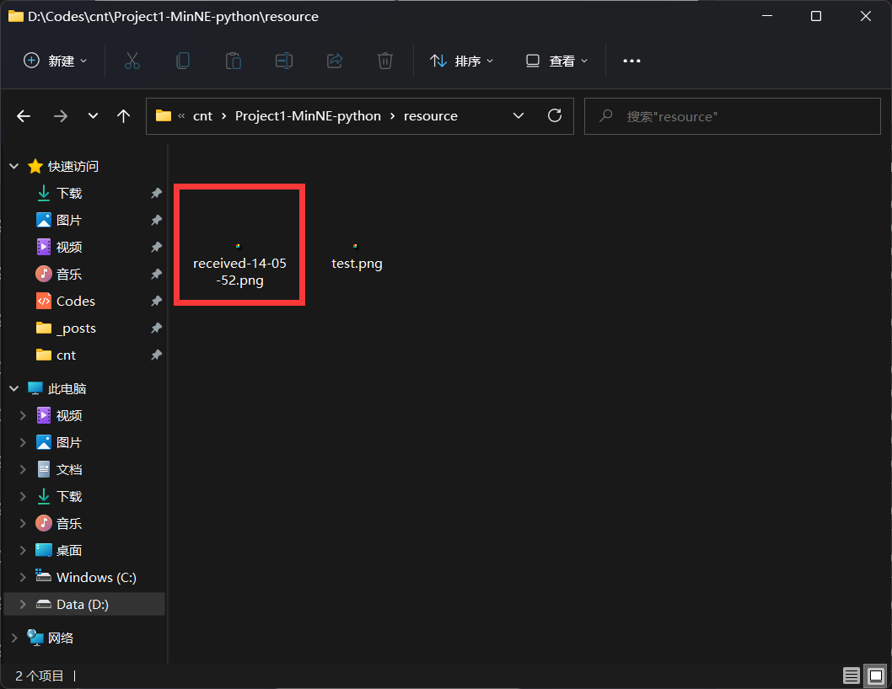
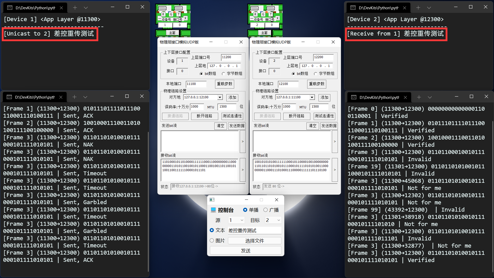
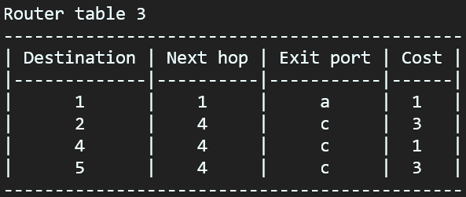

# 项目一阶段三报告

> 蔡与望 2020010801024 程序的架构、编写与调试，报告的撰写
>
> 党一琨 2020140903010 网元与帧的设计
>
> 郭培琪 2020030701003 重要函数的设计
>
> 陶砚青 2020040401013 程序的调试与debug

- [项目一阶段三报告](#项目一阶段三报告)
  - [一、整体架构](#一整体架构)
    - [1.1 网络拓扑](#11-网络拓扑)
    - [1.2 帧结构](#12-帧结构)
    - [1.3 源码总览](#13-源码总览)
      - [1.3.1 目录结构](#131-目录结构)
      - [1.3.2 网元层封装设计](#132-网元层封装设计)
  - [二、物理层](#二物理层)
    - [2.1 连接各网元](#21-连接各网元)
    - [2.2 模拟误码](#22-模拟误码)
    - [2.3 模拟MTU](#23-模拟mtu)
    - [2.4 添加时钟信号等冗余位](#24-添加时钟信号等冗余位)
  - [三、应用层](#三应用层)
    - [3.1 决定网元模式](#31-决定网元模式)
    - [3.2 信息I/O](#32-信息io)
    - [3.3 文本与图片的编解码](#33-文本与图片的编解码)
      - [3.3.1 文本编解码](#331-文本编解码)
      - [3.3.2 图片编解码](#332-图片编解码)
      - [3.3.3 代码实现](#333-代码实现)
    - [3.4 代码框架](#34-代码框架)
    - [3.5 阶段一测试](#35-阶段一测试)
      - [3.5.1 随机数产生与应答](#351-随机数产生与应答)
      - [3.5.2 心得与反思](#352-心得与反思)
  - [四、网络层（主机）](#四网络层主机)
    - [4.1 帧结构](#41-帧结构)
    - [4.2 帧同步与定位](#42-帧同步与定位)
      - [4.2.1 基本原理](#421-基本原理)
      - [4.2.2 代码实现](#422-代码实现)
    - [4.3 地址读写](#43-地址读写)
      - [4.3.1 取16位的原因](#431-取16位的原因)
      - [4.3.2 代码实现](#432-代码实现)
    - [4.4 序号读写](#44-序号读写)
      - [4.4.1 取8位的原因](#441-取8位的原因)
      - [4.4.2 代码实现](#442-代码实现)
    - [4.5 差错检测](#45-差错检测)
      - [4.5.1 基本原理](#451-基本原理)
      - [4.5.2 代码实现](#452-代码实现)
    - [4.6 差错控制](#46-差错控制)
      - [4.6.1 基本原理](#461-基本原理)
      - [4.6.2 采用停等协议的原因](#462-采用停等协议的原因)
      - [4.6.3 Keepalive机制](#463-keepalive机制)
      - [4.6.4 代码实现](#464-代码实现)
    - [4.7 流量控制](#47-流量控制)
      - [4.7.1 基本原理](#471-基本原理)
      - [4.7.2 代码实现](#472-代码实现)
    - [4.8 代码框架](#48-代码框架)
    - [4.9 阶段二测试](#49-阶段二测试)
      - [4.9.1 Unicode字符串I/O](#491-unicode字符串io)
      - [4.9.2 图片的读写](#492-图片的读写)
      - [4.9.3 差错检测与重传](#493-差错检测与重传)
      - [4.9.4 Keepalive机制的触发](#494-keepalive机制的触发)
      - [4.9.5 吞吐量测试](#495-吞吐量测试)
      - [4.9.6 误码承受能力](#496-误码承受能力)
      - [4.9.7 心得与反思](#497-心得与反思)
  - [五、网络层（交换机）](#五网络层交换机)
    - [5.1 维护端口地址表](#51-维护端口地址表)
    - [5.2 支持广播](#52-支持广播)
    - [5.3 代码框架](#53-代码框架)
    - [5.4 阶段三测试](#54-阶段三测试)
      - [5.4.1 单播的支持](#541-单播的支持)
      - [5.4.2 广播的支持](#542-广播的支持)
      - [5.4.3 吞吐量测试](#543-吞吐量测试)
      - [5.4.4 误码承受能力](#544-误码承受能力)
      - [5.4.5 心得与反思](#545-心得与反思)
  - [六、网络层（路由器）](#六网络层路由器)
    - [6.1 路由表](#61-路由表)
      - [6.1.1 基本原理](#611-基本原理)
      - [6.1.2 代码实现](#612-代码实现)
    - [6.2 数据定向投递](#62-数据定向投递)
      - [6.2.1 基本原理](#621-基本原理)
      - [6.2.2 代码实现](#622-代码实现)
    - [6.3 代码框架](#63-代码框架)
    - [6.4 阶段四调试](#64-阶段四调试)
      - [6.4.1 路由表计算](#641-路由表计算)
      - [6.4.2](#642)

<div style="page-break-after:always"></div>

## 一、整体架构

### 1.1 网络拓扑


我们的网络拓扑模型共设有7个网元：1台路由器、2台交换机、4台主机。各网元间形成**树形拓扑**，通过课程提供的物理层模拟软件进行互联。

主机的网元分为三层，分别是**应用层、网络层与物理层**；而路由器与交换机，由于不需要与用户进行I/O操作，不设应用层。各层间通过（手动或自动）设定的端口进行通信。

网元各层的主要功能如下：

- 应用层
  - 决定网元模式
  - 信息I/O
  - 文本与图片的编解码
- 网络层（主机）
  - 帧同步与定位
  - 地址读写
  - 序号读写
  - 差错检测
  - 差错控制
  - 流量控制
- 网络层（交换机）
  - 监听各端口消息
  - 维护端口地址表
  - 多主机信息交换
- 物理层
  - 连接起各网元
  - 模拟误码
  - 模拟MTU
  - 添加时钟信号等冗余位

### 1.2 帧结构

在我们的设计中，单次发送的信息将被分为多个帧，网元间以帧为单位交换信息；帧内除了用户发送的数据，还有网络层添加的各种控制信息，用于实现差控、流控、判收等功能。


上图是我们组设计的帧结构。它包括以下这几部分：

- 帧头、帧尾（8位）
- 源地址、目的地址（16位）
- 帧序号（8位）
- 数据（32位，只能少不能多）
- CRC校验码（16位）
- 冗余（位数不等，帧同步的副产物）

具体每一部分的功能、原理与实现见第3章。

### 1.3 源码总览

程序使用`Python`编写。

#### 1.3.1 目录结构

```txt
Project                       项目一目录
├─ bin                        可执行文件目录
│ ├─ OneTouchToClose.bat      一键关闭所有网元
│ ├─ OneTouchToGo.bat         一键启动所有网元
│ ├─ ne.txt                   物理层配置文件
│ └─ phy.exe                  物理层模拟软件
├─ config                     项目配置文件
│ └─ router_initializer.json  路由表初始配置
├─ img                        图片传输文件目录
│ └─ test.png                 样例图片
└─ src                        源代码目录
  ├─ app.py                   主机应用层入口
  ├─ net.py                   主机网络层入口
  ├─ router.py                路由器网络层入口
  ├─ switch.py                交换机网络层入口
  └─ utils                    自制模块
    ├─ __init__.py            生成模块
    ├─ coding.py              编解码模块
    ├─ constant.py            常量模块
    ├─ frame.py               帧模块
    └─ layer                  网元各层封装模块
      ├─ __init__.py          生成模块
      ├─ _abstract.py         抽象层模块
      ├─ app.py               主机应用层模块
      ├─ net.py               主机网络层模块
      ├─ router.py            路由器网络层模块
      └─ switch.py            交换机网络层模块
```

#### 1.3.2 网元层封装设计


虽然网元的各层都肩负着不同的职责，但它们身为数据的传递者，必定存在一些共性，比如都有确定的端口号和套接字、都可以收发消息等。我们将这些共性抽象出来，创建了**抽象层**（`AbstractLayer`）。它可以实现最简单的收发功能，其收发API只对子类开放，供各层实现进一步分化。在此基础上：

- **主机应用层**（`AppLayer`）增加了与用户、网络层交互的功能；
- **主机网络层**（`NetLayer`）增加了与应用层、物理层交互的功能；
- **交换机网络层**（`SwitchLayer`）增加了`select`监听、与物理层交互的功能；同时继承**端口地址表**（`SwitchTable`），可以对其进行CRUD操作。
- **路由器网络层**（`RouterLayer`）增加了`select`监听、与物理层交互的功能；同时继承**路由表**（`RouterTable`），可以对其进行更新。

## 二、物理层

在整个网元中，物理层主要有四种功能：

- 连接各网元
- 模拟误码
- 模拟MTU
- 添加时钟信号等冗余位

下面将分别展示这四种功能。

### 2.1 连接各网元

在[网络拓扑图](#11-网络拓扑)中，我们可以看到有许多线连接着各个网元。这些网元间的连接——也就是收发消息的重要桥梁——正是物理层模拟软件提供的。

为了完成我们的拓扑，我们运行程序时将打开十几个物理层软件，而一个个去配置它们的参数显然是不现实的。所以我们根据拓扑图，编写了配置文件`ne.txt`；在物理层启动时，它可以告诉每个物理层各自的参数。

如下图，我们实现的是主机1、主机2与交换机3相连的拓扑。


除此之外，我们还编写了批处理文件`OneTouchToGo.bat`和`OneTouchToClose.bat`，分别可以一键启动和关闭拓扑内的所有网元；这也大大降低了我们调试的难度。

下图的批处理文件与上图的`ne.txt`相适配。使用时双击即可。


### 2.2 模拟误码

对误码的承受能力，是衡量一个通信系统性能的重要指标。物理层模拟软件可以轻松地做到这一点，只需要在主窗内更改误码率即可。

通过网上查阅资料、小组讨论，以及项目四调制解调的经验，我们依误码率将信道划分为三个等级：

| 误码率（十万分之） | 信道环境 |
| :----------------: | :------: |
|       0-500        |   优质   |
|      500-2000      |   一般   |
|       >2000        |   恶劣   |

在下文中，当我们模拟优质信道环境时，我们将令误码率为**十万分之20**；一般信道环境为**十万分之1000**，恶劣信道环境为**十万分之10000**。

### 2.3 模拟MTU

MTU（Maximum Transmission Unit），最大传输单元，也即单次允许传输的最大字节数。对于当下广泛使用的以太网标准来说，这个值为1500字节。

但实际上，我们的帧只占100余位左右，远远低于这一限制；所以我们组在此标准的基础上进行了缩小，设物理层模拟软件的MTU为1500位，而非1500字节。（理论上，150位也是足够充裕的。）

### 2.4 添加时钟信号等冗余位

当我们在真实的信道中传输数据时，接收端得到的只有比特流，而并不知道帧的起始在哪里；这就需要通信双方约定协议来解决定位问题。

为了模拟这一事实，物理层模拟软件会在传输的信息前后各添加若干比特的冗余位，如下图所示。


而我们则需要设计帧定位方案来对抗这一问题，见[4.2节](#42-帧同步与定位)。

## 三、应用层

在整个网元中，应用层主要有三种功能：

- 决定网元模式
- 信息I/O
- 文本与图片的编解码

下面将分别展示这三种功能。

### 3.1 决定网元模式

由于多线程代码的编写具有一定难度，本项目中的网元只采用单线程、半双工模式，即同时只能处于接收、单播、广播中的一种。这一选择将通过用户手动输入来激活，然后应用层负责将用户的选择通知到下层。

### 3.2 信息I/O

应用层作为与用户实际交互的门户，它不仅负责向用户呈现出完整、合理的信息（Input），还负责从用户处获取正确、可传输的信息（Output）。

为了操作的便利，本项目中将使用`str`类型，进行绝大部分信息的操作。相应地，信息的I/O只需要调用`input()`和`print()`就能够实现，唯一的注意点就是需要在用户输入时，判断输入的合理性。

这些行为虽然不涉及套接字，但我们仍然将其封装在了`AppLayer`类内，意图在和“与网络层交互”的代码形成呼应，强调应用层也应该有向上递交消息的功能。

### 3.3 文本与图片的编解码

由于物理层只能传输01比特流，所以我们需要设计一套编解码方案，建立起文本/图片与01比特流的映射规则。

#### 3.3.1 文本编解码

由于项目需要提供对中文I/O的支持，所以显然ASCII码无法满足项目的需求，而是需要**针对Unicode字符设计编解码方案**，具体流程如下：


#### 3.3.2 图片编解码

我们采用**base64编解码方案**，这是一种常见的图片编解码方案。为了加快运行速度、提高代码简洁性，我们直接调用内置库`base64`的编解码函数进行图片操作，具体流程如下。


其中的`encode_text()`和`decode_text()`与[Unicode编解码方案](#331-文本编解码)类似，只是操作位数略有不同。

#### 3.3.3 代码实现

函数的具体代码可以在`utils/coding.py`中找到，该模块留下8个API供外部调用：

- `dec_to_bin()`：将十进制整型数转化为01字符串；
- `bin_to_dec()`：将01字符串转化为十进制整型数；
- `string_to_bits()`：将01字符串转化为01比特流；
- `bits_to_string()`：将01比特流转化为01字符串；
- `encode_text()`：将Unicode字符串编码为01字符串；
- `decode_text()`：将01字符串解码为Unicode字符串。
- `encode_pic()`：将图片编码为01字符串；
- `decode_pic()`：将01字符串解码为图片。

### 3.4 代码框架

细化[3.1节](#31-决定网元模式)的逻辑后，我们很容易得出应用层的代码框架：

```Python
while True:
  mode = input_mode()

  if mode == QUIT:
    break

  elif mode == RECV:
    receive_message_type()
    receive_message()
    continue

  # 单播只比广播多一步获取目的端口，发送部分的代码可以合并。
  elif mode == UNICAST:
    input_port()

  input_message_type()
  send_message_type()

  input_message()
  send_message()
```

### 3.5 阶段一测试

#### 3.5.1 随机数产生与应答

为了给接下来的阶段做铺垫，我们需要先写两个简单的应用层，对网元工作的模式、网元间通信的方式有一定的理解。根据项目指导书中的需求，我们编写了一个服务器、一个客户端，下面是我们测试的结果。

> 项目需求：
> 客户端定时每500ms向服务器发送一个随机整数，范围在1~500之间；
> 服务器每收到一份数据也同时产生随机整数与收到的数据相加，只有在结果大于100时才会把计算结果返回给客户端，而客户端收到超出100的结果则立即产生一个新的数据，而不是在间隔500ms后。
> 客户机需要产生20份数据，如果有超过100的结果，总运行时间应接近10-N*0.5，N为超过100的结果的数量。


可以看到，服务器与客户端之间能够进行稳定的通信，客户端通过`select()`实现了超时的判断，实际运行时间与预期时间（10-N*0.5）相符。

#### 3.5.2 心得与反思

通过阶段一的程序，我们了解了控制超时的两种方法：`settimeout()`和`select()`，同时也知道如何基于不同事件做出不同的响应，对网元间通信的形式、时序等有了进一步了解。

我们未来将会考虑为应用层添加GUI，方便用户的观测与操作。

## 四、网络层（主机）

在整个网元中，主机网络层的功能最多、最重要，主要分为六部分：

- 帧同步与定位
- 地址读写
- 序号读写
- 差错检测
- 差错控制
- 流量控制

下面我们将先展示帧的结构，然后分别展示这六种功能。

### 4.1 帧结构

为了方便对帧的各部分进行操作，我们利用`Python`“面向对象”的特点，将帧封装为一个类，下面是这个类的结构。

```Python
class Frame:
  def __init__(self):
    """初始化帧属性。"""
    pass

  def __str__(self):
    """打印帧信息。"""
    pass

  @property
  def some_property(self):
    """将帧的某一属性设为只读。"""
    pass

  def write(self, ...):
    """将信息写入帧。"""
    pass

  def read(self, ...):
    """将01字符串解析为帧。"""
    pass

  def __extract_message(...):
    """帧定位与反变换。"""
    pass

  def __add_locator(...):
    """帧同步。"""
    pass

  def __generate_crc(...):
    """生成CRC校验码。"""
    pass

  def calc_frame_num(...):
    """计算消息需要分多少帧发送。"""
    pass
```

通过封装帧，我们可以直接对01字符串进行读写，这也使得网络层代码的描述性、可读性变得更强，逻辑更加清晰。具体的代码可以在`utils/frame.py`中找到。

### 4.2 帧同步与定位

如同[2.4节](#24-添加时钟信号等冗余位)所说，发送端和接收端需要约定协议，让双方能在杂乱的比特流中，找到对方发来的信息。

我们采用**面向位的首尾定界法**进行帧同步与定位。

#### 4.2.1 基本原理

- 发送端：变换，添加帧头帧尾。
  1. 在一帧的首尾加上`0111 1110`，以标识帧的始末位置；
  2. 帧内的信息也有可能出现`0111 1110`的序列，所以为了防止接收端把帧内信息误当作帧尾，发送端还要在帧内的每个`11111`后面插一个`0`，以免帧内出现`0111 1110`子序列。

- 接收端：找到帧头，反变换。
  1. 在物理层收到的乱码中，找到帧头`0111 1110`，然后把帧头剥落；
  2. 对于接下来出现的每个`11111`子序列：
     1. 如果接下来出现的是`0`，那这个`0`肯定是发送端插的，删掉还原。
     2. 如果接下来出现的是`1`，那这就是帧尾`0111 1110`。（因为发送方已经保证了帧内不可能出现连续6个`1`。）

#### 4.2.2 代码实现

我们在`Frame`类内添加了两个私有静态方法，实现帧同步与定位功能：

- `__add_locator()`：实现上述发送端的任务，在写入信息时调用；
- `__extract_message()`：实现上述接收端的任务，在读入信息时调用。

具体的代码可以在`utils/frame.py`的`Frame`类中找到。

### 4.3 地址读写

发送端需要在帧内写入源与目的的地址，用于后续交换、路由的实现；接收端需要从帧内读取源与目的的地址，知道信息从哪来、是不是给自己的。

我们采用**16位二进制数**来标识地址。

#### 4.3.1 取16位的原因

由于本项目的网元间通信只在本机（127.0.0.1）实现，所以只需要封装源与目的地的端口即可。又因为端口范围是0~65535，所以每个端口需要用16位二进制表示。

#### 4.3.2 代码实现

发送端只需要使用简单的`f-string`字符串拼接，即可把地址写入帧；接收端也只需要用字符串切片，就可以提取地址信息。不再展开叙述。

### 4.4 序号读写

在帧内写入序号可以防止传送时的帧间乱序或重复，对于差错控制协议至关重要。

我们采用**8位二进制数**来标识序号。

#### 4.4.1 取8位的原因

项目需求提出，传输数据上限约50个字符；又根据[3.3节](#33-文本与图片的编解码)得出的结论：一个字符为16位，所以一段消息最多有800位。

一帧最多传输32位数据，所以一段消息最多要用25帧，才能传输完毕。

又为了CRC码在代码实现上的便利（见[4.5节](#45-差错检测)），序号位数需要是4的倍数；于是我们可以选择4位或8位，即0~15或0~255。理论上，4位就已经足够使用；但我们想要为单次发送过程中的每一帧都标上独特序号，加之4位的开销也并不算很大，所以采用了8位序号。

#### 4.4.2 代码实现

序号读写与地址读写相似，只需要简单的拼接和切片即可实现。不再展开叙述。

### 4.5 差错检测

差错检测是整个网络层代码中至关重要的一步，它需要检查信息有没有传错，如果出错就要求重传。

我们采用**CRC-16校验码**，只检错、不纠错。

#### 4.5.1 基本原理

- 发送端：产生校验码。

  1. 将包含源地址、序号、数据、目的地址这四部分信息拼接为01字符串；
  2. 使用生成式$x^{16}+x^{15}+x^{2}+1$，对其进行模2除法；
  3. 得到的余数即为校验码。

- 接收端：检验校验码。

  1. 提取出源地址、序号、数据、目的地址这四部分信息；
  2. 使用与发送端同样的方法进行模2除法；
  3. 与校验码比较是否相同，相同即验证通过。

根据原理，我们可以得到，该校验码可以检测出：

- 所有两位差错；
- 任意奇数个比特的差错；
- 所有长度不超过16的突发差错。

当突发差错多于16比特，其漏检率约为0.003%，而这对于我们88位的帧信息而言，基本可以忽略不计。在此我们认为，帧内的CRC-16校验码可以捕获到所有差错。

#### 4.5.2 代码实现

我们在`Frame`类内添加了私有静态方法`__generate_crc()`，实现了对任意（长度为4的倍数的）01字符串的校验码生成。

具体的代码可以在`utils/frame.py`的`Frame`类中找到。

### 4.6 差错控制

当接收端通过CRC-16校验码检测到帧内有错误，它就需要以某种方式告诉发送端，这帧错了，需要重传；而发送端也相应地需要等待接收端的回复，以确定是否需要重传。

我们采用**停等协议**来进行差错控制。

#### 4.6.1 基本原理

1. 发送端：发送了一帧消息，等待各接收端回复；
2. 接收端：
   1. 如果超时，则什么都不做；
   2. 如果收到了，但是不是给自己的，则什么都不做；
   3. 如果收到了，但是重复了，则丢弃并回复`ACK`；
   4. 如果收到了，但是校验失败，则回复`NAK`；
   5. 如果收到了，并且校验通过，则回复`ACK`；
3. 发送端：
   1. 如果每个发送端都回复了`ACK`，则继续发下一帧；
   2. 否则重传这一帧。
4. 回到第1步，直到传完所有帧。

#### 4.6.2 采用停等协议的原因

- 可以顺便控制流量：发送端需要等回复，所以不会发得太快；
- 编程难度大大降低：只需要实现简单时序逻辑。

#### 4.6.3 Keepalive机制

在差控的同时，我们还引入了Keepalive机制，这一机制将在任意一端连续多次接收超时的时候触发，用于终止无限的等待或重传。这一机制有三个作用：

1. 如果是发送端多次超时：
   1. 如果是由于信道环境恶劣引起的，那么发送端将暂时停止重传，要求用户在信道环境恢复良好时，重新输入信息并发送。（就好像QQ如果断网了，发出去的消息会在几十秒后显示红色叹号，告诉用户网络不好，没发出去。）
   2. 如果是由于目的端口不存在引起的，那么发送端停止发送就能及时止损，让用户重新输入正确的端口。
2. 如果是接收端多次超时，说明发送端可能已经发完了，但自己还在进行无谓的等待，那么Keepalive机制能够结束等待，准备下一次接收。

#### 4.6.4 代码实现

根据[4.6.1节](#4.6.1-基本原理)所展示的时序，我们可以搭建出双端代码差错控制协议的框架：

- 接收端

```Python
while True:
  receive_one_frame()

  if timeout:
    continue

  if too_many_timeout:
    break

  if not send_to_me:
    continue

  if is_repeated:
    send_ack()
    continue

  if not verified:
    send_nak()
    continue

  accept_message()
  send_ack()

  break_if_this_is_the_last_frame()
```

- 发送端

```Python
while True:
  send_one_frame()

  for _ in range(receiver_num):
    receive_one_frame()

    if timeout:
      break

    if is_ack:
      ack_count += 1

  if too_many_timeout:
    break

  if all_receivers_say_ack:
    send_count += 1

  if all_frames_are_sent:
    break
```

### 4.7 流量控制

由于我们不可能做到每两台主机间都连一条链路，所以主机间必然会有转发的中介，同时也必然带来一定的延时。这就要求双方不能发得太快，导致中间的交换机、路由器来不及处理，对方来不及读取……等等后果。

我们采用`time.sleep()`函数来进行流量控制。

#### 4.7.1 基本原理

如果发送端发的速度过快，那么有可能导致：

- 发送端口来不及发；
- 网络来不及传；
- 接收端口来不及收；
- 接收端来不及处理。
- ……

所以，在调用`sendto()`函数前，让程序先睡眠适当的时间，就可以做到：等上一波信息完全发出去之后，再发这一波信息。

#### 4.7.2 代码实现

只需要在`sendto()`的上一行调用`time.sleep()`即可。

这一操作被封装在了`NetLayer`类内，具体的代码可以在`utils/layer.py`中找到。

### 4.8 代码框架

将以上所有的功能配合起来，我们就可以得到网络层的代码框架：

```Python
while True:
  mode = get_mode_from_app()

  if mode == QUIT:
    break

  elif mode == RECV:
    receiver_codes_shown_above()
    send_message_type_to_app()
    send_message_to_app()
    continue

  else:
    get_destination_from_app()
    get_message_type_from_app()
    get_message_from_app()
    capsulate_all_frames()
    sender_codes_shown_above()
```

### 4.9 阶段二测试

根据上面的代码框架，我们在阶段二写出了应用层与网络层，并使用物理层模拟软件模拟了信道，在两个网元间进行了测试，结果如下。

#### 4.9.1 Unicode字符串I/O

在本测试中，我们从11300端口向12300端口发送文本“hello,世界。”，这一字符串中同时包含了中英文与中英文符号。可以看到，双方应用层能够正确编解码，最终在12300端口呈现出原本的字符串。


根据指导书要求，双方至少需要支持50个中英文字符的传输。于是在本测试中，我们从11300端口向12300端口发送文本“abcd...zabcd...z”，即两遍字母表（52个英文字符）。可以看到，12300端口成功收到了这一字符串。


#### 4.9.2 图片的读写

在本测试中，我们从11300端口向12300端口发送图片“test.png”。由于我们平时生活中的图片大多都有上百万位，使用我们编写的系统耗时实在过长，所以我们自行绘制了一幅4*4尺寸的微型图片，用于简单的测试图片传输效果。


可以看到，图片成功地以比特流形式从一端传到了另一端，并保存在了/img文件夹下。



打开/img目录，我们可以发现一张一模一样的图片“received.png”，这就是接收端收到并解码的图片。


#### 4.9.3 差错检测与重传

在本测试中，我们设置物理层误码率为十万分之500，0.5%。可以看到，传输过程中出现了三次超时、一次负确认，但通过双方网络层的检错、差控与重传，接收端应用层最终能够呈现出正确、完整的字符。



#### 4.9.4 Keepalive机制的触发

当信道环境十分恶劣时，发送端的Keepalive机制将被触发，停止重传，用户需要重新发送信息。


当信道恢复至优质环境，用户重新输入的信息就可以再次发送，接收端也可以正确接收。


#### 4.9.5 吞吐量测试

在本测试中，我们会以比特速率（bps）来衡量交换机性能。每次测试在不同误码率下，发送信息“helloworld”，然后由网络层计算出每次发送的网速；如果接收端成功接收，就记录下这次的网速。

两边的物理层误码率从0到1%每0.1%为一档，每档测试3次取平均值。使用`Python+Matplotlib`绘制出测试结果曲线如下：


在信道环境良好的情况下，吞吐量最高可以达到4500bps左右；随着误码率提高，吞吐量总体呈下降趋势。

#### 4.9.6 误码承受能力

在本测试中，我们将测试系统对误码的承受能力。我们将逐步提高误码率，步进0.5%，当连续3次触发双方的Keepalive机制时，则认为系统达到误码承受能力上限。测试结果如下表：

|    误码率     |    发送端     |    接收端     |
| :-----------: | :-----------: | :-----------: |
|   $0-1.5\%$   |   成功发送    |   成功接收    |
| $2.0\%-2.5\%$ | 触发Keepalive |   成功接收    |
|  $\ge 3.0\%$  | 触发Keepalive | 触发Keepalive |

由此我们可以说，该系统对误码的承受能力在3%左右；高于3%时，用户需要等待信道恢复良好时，再重新输入消息。

#### 4.9.7 心得与反思

通过阶段二的程序编写，我们深入了解了网络层（与数据链路层）各种功能的基本原理，同时对停等协议下双端的交互时序有了深刻的体会。

我们的主机网络层仍存在不尽人意之处，例如停等协议实在太简单粗暴，大大限制了发送与接收的速度；流量控制也过分简陋，不能根据网路状态进行自适应。但令我们感到满意的是，我们的几次联调中，均未发现任何的bug。

## 五、网络层（交换机）

在网络拓扑中，交换机负责在多个主机间交换信息，从而让广播成为可能，同时也减少了P2P通路的数量。它主要有两种功能：

- 维护端口地址表
- 支持广播

下面我们将分别展示这两种功能。

### 5.1 维护端口地址表

对于主机而言，它的信息只有一条路可走——就是发到自己的物理层，然后交给交换机。但对于交换机而言，它的信息有不止一条路可走。

直接广播给所有端口然后让它们自行判收，显然是浪费信道资源的一种做法，我们更希望交换机自己能够记住，发给谁的信息要走哪个端口。这就需要它内部维护一张对照表，将本地自己的物理层端口与远程其他主机的应用层端口联系起来。

同时，端口地址表，在高误码率情况下，有可能记录错误的端口；我们还希望端口地址表能够自行清理这些错误的端口。这就需要交换机为每个端口设置一个生存周期，当端口过期，就自动清除它。

我们使用`collection.defaultdict(dict[str, int])`类型对此进行管理。

使用`JSON`描述端口地址表内部数据如下：

```JSON
{
  "13100": {      // 交换机的物理层13100。
    "11300": 5,   // 从这个端口可以去往应用层11300，当前寿命为5。
    "65535": -1   // 广播端口65535的寿命无限。
  },
  "13101": {      // 交换机的物理层13101。
    "12300": 4,   // 从这个端口可以去往应用层12300，当前寿命为4。
    "65535": -1   // 广播端口65535的寿命无限。
  }
}
```

在主程序中，每一次交换机接收到信息，它都会：

1. 刷新一次端口地址表，剔除过期的端口，同时反向学习；
3. 根据发来的帧的目的端口进行查询，看要发到哪个物理层端口。

我们在`SwitchLayer`中封装了这两个方法，分别是：

- `refresh()`：上述任务1；
- `search_locals()`：上述任务2。

具体代码实现逻辑较复杂，不在此叙述，源文件内有详细注释。

### 5.2 支持广播

为了实现广播，交换机需要截获并读取帧，判断帧内消息发送的形式（单播或广播），然后据此采取相应的行动。

如果是单播消息，就在端口地址表中查询应该送到哪个端口。如果查到了，就发向这个端口；如果没找到，就发向各个物理层，接收端回复时就能反向学习了。

如果是广播消息，就直接发向各个物理层。

### 5.3 代码框架

将以上的两部分结合起来，就是交换机网络层的代码框架。

```Python
while True:
  if not has_message():
    continue

  receive_message()

  refresh()
  search_where_should_I_send_this_frame()

  if search_success:
    unicast_to_this_port()
  else:
    broadcast_to_every_port()
```

### 5.4 阶段三测试

#### 5.4.1 单播的支持


在测试中，我们从11300端口向12300单播“hello”。可以看到，交换机能够正确的学习并更新端口地址表，并充当两主机发送、回复、重传的桥梁，消息最终完好地传递到了12300端口。

#### 5.4.2 广播的支持


在测试中，我们从11300端口向所有端口广播“hello”。可以看到，在11300发送时，交换机能够正确识别出这是广播消息，并广播给所有剩余端口；在12300回复时，交换机也能够正确识别出这是单播消息，并单播给11300。最终，消息完好地传递到了所有端口。

#### 5.4.3 吞吐量测试

测试方法与[4.9.5节](#495-吞吐量测试)基本一致，但本次测试调整的是交换机两个物理层端口的误码率，从0到1%，每0.1%为一档。

同样绘制曲线如下：


左边是[4.9.5节](#495-吞吐量测试)的曲线，作为对照；右边是本次有交换机的吞吐量测试结果。在信道环境优质的情况下，吞吐量最高可以达到3000bps左右；随着误码率提高，吞吐量总体呈下降趋势。

#### 5.4.4 误码承受能力

测试方法与[4.9.6节](#496-误码承受能力)基本一致，但本次测试调整的是交换机两个物理层端口的误码率。

在本测试中，我们将测试系统对误码的承受能力。我们将逐步提高误码率，步进0.5%，当连续3次触发双方的Keepalive机制时，则认为系统达到误码承受能力上限。测试结果如下表：

|    误码率     |    发送端     |    接收端     |
| :-----------: | :-----------: | :-----------: |
|   $0-1.5\%$   |   成功发送    |   成功接收    |
| $2.0\%-2.5\%$ | 触发Keepalive |   成功接收    |
|  $\ge 3.0\%$  | 触发Keepalive | 触发Keepalive |

由此我们可以说，该系统对误码的承受能力在3%左右，与无交换机时一致；高于3%时，用户需要等待信道恢复良好时，再重新输入消息。

#### 5.4.5 心得与反思

通过阶段三的程序编写，我们对端口地址表的实现有了深刻的体会，同时也了解了“反向学习”，这一个初听神秘、现在熟知的功能。同时，我们也在编写广播功能的同时，认识到了广播风暴的根源。

同时我们也清楚，我们的交换机只适用于最简单的拓扑网络；由于我们并没有实现生成树算法，我们的交换机无法应对环形拓扑的死循环症状。这是接下来我们要考虑的一大问题。

## 六、网络层（路由器）

相比起交换机，路由器有更全局的视野、更智能的实体；交换机解决不了的投递定向问题，路由器可以解决。在整个网络中，路由器主要有两种功能：

- 维护路由表
- 数据定向投递

下面将依次展示这两种功能。

### 6.1 路由表

路由表是路由器的核心所在：后者正是依靠对前者的不断更新与维护，才能做到对网络全局的把控、对数据包的精准投递。

我们采用**链路状态算法**来维护路由表。

#### 6.1.1 基本原理

链路状态算法主要采用**链路延时**作为衡量链路状态的标准：链路的延时越高，意味着“走这条路到达别的路由器的代价”就越高。每台路由器只关心自己周围的链路状态，据此更新自己的路由表，然后将自己的路由表扩散到全网的路由器。

当路由器接收到来自其它路由器的路由表时，它会采用**Dijkstra算法**计算出到达全网各点的最佳路径，即“费用最低”的路径。具体实现如下：

1. 一开始，只记录相邻链路的费用，而认为其它所有节点的费用均为无穷；
2. 选择路由表中费用最低的路径P，将其标记为“最优化”，不再对其进行更新；
3. 接收P的终点路由器T的路由表，然后在此基础上，判断“先走T，再走T的邻路”是否能让自己更快地到达T的邻居。如果是，则更新自己的路由表；
4. 重复2、3，直到路由表中的每一条路径都被标记为“最优化”。

#### 6.1.2 代码实现

我们将`Dijkstra`算法等重要函数封装在了`RouterTable`类内；路由表通过`merge()`函数即可迅速实现本地路由表与新路由表的合并。对于路由器间的信息交互，我们设置了`pack()`和`unpack()`函数，以便捷地打包、解包路由表。具体代码见`layer/router.py`。

### 6.2 数据定向投递

我们常说，路由表“划分了广播域”，所有的广播消息都不会穿过路由器。这一叙述的实际含义就在于，路由器总是知道帧的目的地在哪里、应该投递给谁；而不会像交换机那样，遇到不认识的端口就直接广播。

#### 6.2.1 基本原理

在实际的生活中，寻址是通过ARP（地址解析协议）完成的，它能够将IP地址映射到MAC地址。但由于本项目的网络拓扑模型较小，且限于本机套接字间通信，加之物理层模拟软件限制了端口号各位的意义，我们可以——并且也只能——自定义一种映射方案来简化这一过程。方案如下：

- 端口号定义：
  - 第1位统一为`1`；
  - 第2位为设备号；
  - 第3位为层次号：应用层为`3`，网络层为`2`，物理层为`1`；
  - 第4-5位为实体号，从`00`开始编号。

> 例如，设备2的物理层实体3的端口号为`12103`。

- 路由器寻址：
  - 设有$a$台路由器，路由器$i$的设备号记为$R_i$，其下属的主机设备号集合记为$S_i$，主机$j$的设备号记为$D_j$；
  - $R_i=i,\forall \;i\le a$
  - $D_j=j,\forall \;j>a$
  - $D_j\equiv R_i(mod\;a)\Rightarrow j\in S_i$

> 例如，现有3台路由器，则它们的设备号分别为1、2、3；那么路由器1就知道主机4和主机7都是自己的下属，而主机5和主机8都是路由器2的下属。

- 投递过程：
  - 用户指定设备号，而非端口号；
  - 网元将目的设备号映射为目的应用层端口号。

> 例如，用户指定向设备4投递消息，则网元将其映射为14300。

#### 6.2.2 代码实现

这一映射与反映射需要主机应用层和路由器网络层的共同努力。我们在`AppLayer`类内封装了`_get_dst_from_user()`方法，支持设备号到端口号的映射；在`RouterLayer`类内封装了`search()`方法，支持端口号到设备号的反映射。具体代码见`layer/app.py`和`layer/router.py`。

### 6.3 代码框架

### 6.4 阶段四调试

#### 6.4.1 路由表计算

在本测试中，为了测试我们编写的路由表在拥有较多路由器的拓扑网络中的表现，我们另外编写了一套拓扑配置，拓扑图如下：


其`JSON`文件见附录。我们只导入路由表（`RouterTable`类），进行不依赖套接字的测试。测试结果如下：

|                                   |                                   |
| :-------------------------------: | :-------------------------------: |
|  |  |
|  |  |
|  |                                   |

对照拓扑图，我们很容易验证其正确性。所以，我们组编写的路由表是正确有效的。

#### 6.4.2
