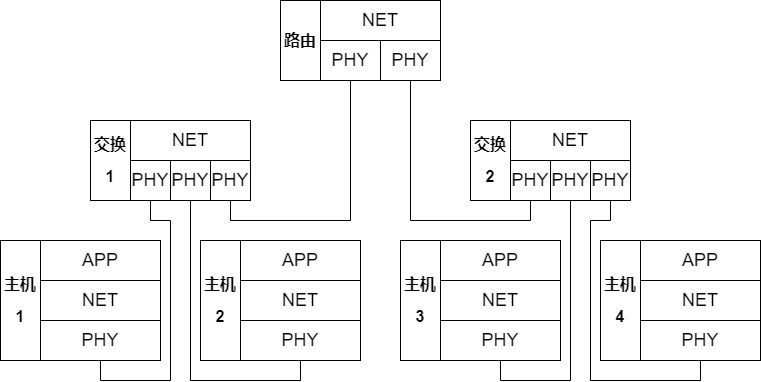
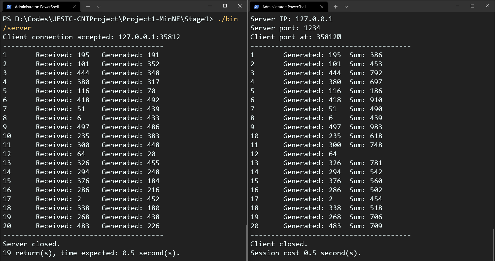

# 项目一阶段一报告

> 组号：2
>
> 组员：蔡与望，党一琨，郭培琪，陶砚青

## 整体架构



在我们的架构中，一个网元分为三层，分别是应用层、网络层与物理层。整体设7网元（1路由+2交换+4终端）。

### 发送终端

- 应用层：与用户交互信息，并将信息编码：包括传输的字符串，网元所处的模式（接收、单播、广播），单播中的目的地地址。
- 网络层：进行封装：包括帧头帧尾的定位码，源和目的地的地址码，帧序号，CRC校验码。
- 物理层：使用课程提供的物理层模拟软件，实现比特流传输。

### 接收终端

- 物理层：使用课程提供的物理层模拟软件，实现比特流传输。
- 网络层：依靠定位码定位帧始末位置，读取目的地地址。
  - 如果目的地是本机，则继续读取源地址、帧序号，并使用CRC校验码检错，有可能要求重传。
  - 如果目的地不是本机，则进行转发。
- 应用层：解码比特流，呈现给用户可读信息。

### 交换机与路由器

由于交换机与路由器不是用户交互的对象，所以不设应用层，但仍会在捕获比特流时，显示必要的debug信息。
在传输信息时，他们会读取目的地地址，交换机判断下一步路径，路由器则进行简单的转发。

## 阶段一代码

### 服务器

```C++
/**
 * @name: server.cpp
 * @author: 蔡与望，党一琨，郭培琪，陶砚青
 * @description:
 * 接收客户端的随机数，并产生新随机数；如果总和超过上限，则将总和返回给客户端。
 */
#include <ctime>
#include <iostream>
#include <winsock2.h>
#include <windows.h>
using namespace std;

#define MAX_BUFFER_SIZE 512
#define SUM_BORDER 100

int main(int argc, char *argv[]) {
    // 随机数的随机种子。
    srand(time(NULL));

    // 初始化 DLL 与网络库。
    WSADATA wsaData;
    int state = WSAStartup(MAKEWORD(2, 2), &wsaData);
    if (state != 0) {
        cout << "Error: WSAStartup() failed. (" << WSAGetLastError() << ")"
             << endl;
        return -1;
    }

    // 创建服务器套接字。
    SOCKET serverSocket = socket(AF_INET, SOCK_STREAM, IPPROTO_TCP);
    if (serverSocket == INVALID_SOCKET) {
        cout << "Error: Invalid server socket. (" << WSAGetLastError() << ")"
             << endl;
        return -1;
    }

    // 确定服务器地址。
    SOCKADDR_IN serverAddress;
    int serverSize = sizeof(serverAddress);
    serverAddress.sin_family = AF_INET;
    serverAddress.sin_addr.S_un.S_addr = inet_addr("127.0.0.1");
    serverAddress.sin_port = htons(1234);

    // 绑定服务器套接字与地址。
    state = bind(serverSocket, (SOCKADDR *)&serverAddress, serverSize);
    if (state == SOCKET_ERROR) {
        cout << "Error: bind() failed. (" << WSAGetLastError() << ")" << endl;
        closesocket(serverSocket);
        return -1;
    }

    // 服务端开始监听。
    state = listen(serverSocket, 5);
    if (state == SOCKET_ERROR) {
        cout << "Error: listen() failed. (" << WSAGetLastError() << ")" << endl;
        closesocket(serverSocket);
        return -1;
    }

    // 接受客户端连接请求，系统分配客户端端口号。
    SOCKADDR_IN clientAddress;
    int clientSize = sizeof(clientAddress);
    SOCKET clientSocket =
        accept(serverSocket, (SOCKADDR *)&clientAddress, &clientSize);
    if (clientSocket == INVALID_SOCKET) {
        cout << "Error: Invalid client socket. (" << WSAGetLastError() << ")"
             << endl;
        return -1;
    }
    cout << "Client connection accepted: " << inet_ntoa(clientAddress.sin_addr)
         << ":" << clientAddress.sin_port << endl;

    // 通知客户端其端口号。
    string portStr;
    portStr = to_string(clientAddress.sin_port);
    send(clientSocket, portStr.c_str(), portStr.length(), 0);

    // 开始与客户端通信。
    cout << "---------------------------------------" << endl;
    char recvStr[MAX_BUFFER_SIZE];
    int returnCnt = 0;
    for (int index = 0; index < 20; index++) {
        // 清空接收区。
        memset(recvStr, '\0', sizeof(recvStr));
        // 接收客户端发来的数字。
        int recvLen = recv(clientSocket, recvStr, MAX_BUFFER_SIZE, 0);
        if (recvLen > 0)
            recvStr[recvLen] = '\0';
        else
            continue;
        int recvNum = atoi(recvStr);
        cout << index + 1 << "\tReceived: " << recvNum;
        // 产生随机数并相加。
        int randNum = rand() % 500 + 1;
        cout << "\tGenerated: " << randNum << endl;
        int sum = recvNum + randNum;
        // 如果超过上限，则把结果返回客户端。
        if (sum > SUM_BORDER) {
            string sumStr = to_string(sum);
            send(clientSocket, sumStr.c_str(), sumStr.length(), 0);
            returnCnt++;
        }
    }

    // 关闭服务。
    closesocket(serverSocket);
    WSACleanup();
    cout << "---------------------------------------" << endl;
    cout << "Server closed. " << endl;
    cout << returnCnt << " return(s), time expected: " << 10 - 0.5 * returnCnt
         << " second(s)." << endl
         << endl;
    return 0;
}
```

### 客户端

```C++
/**
 * @name: client.cpp
 * @author: 蔡与望，党一琨，郭培琪，陶砚青
 * @description:
 * 每`500ms`向服务器发送一个随机数，如果服务器有返回则立刻发送新随机数。
 */
#include <ctime>
#include <iostream>
#include <winsock2.h>
#include <windows.h>
using namespace std;

#define MAX_BUFFER_SIZE 512

int main(int argc, char *argv[]) {
    // 随机数的随机种子。
    srand(time(NULL));
    // 超时`500ms`未接到服务器返回值，则发送下一个数字。
    TIMEVAL timeout = {0, 500000};
    // 计时器。
    clock_t start, end;

    // 初始化 DLL 与网络库。
    WSADATA wsaData;
    int state = WSAStartup(MAKEWORD(2, 2), &wsaData);
    if (state != 0) {
        cout << "Error: WSAStartup() failed. (" << WSAGetLastError() << ")"
             << endl;
        return -1;
    }

    // 创建客户端套接字。
    SOCKET clientSocket = socket(AF_INET, SOCK_STREAM, IPPROTO_TCP);
    if (clientSocket == INVALID_SOCKET) {
        cout << "Error: Invalid client socket. (" << WSAGetLastError() << ")"
             << endl;
        return -1;
    }

    // 输入服务器地址。
    string serverIp = "";
    int serverPort = 0;
    cout << "Server IP: ";
    cin >> serverIp;
    cout << "Server port: ";
    cin >> serverPort;
    SOCKADDR_IN serverAddress;
    int serverSize = sizeof(serverAddress);
    serverAddress.sin_family = AF_INET;
    serverAddress.sin_addr.S_un.S_addr = inet_addr(serverIp.c_str());
    serverAddress.sin_port = htons(serverPort);

    // 客户端套接字绑定服务器地址。
    state = connect(clientSocket, (SOCKADDR *)&serverAddress, serverSize);
    if (state == SOCKET_ERROR) {
        cout << "Error: connect() failed. (" << WSAGetLastError() << ")"
             << endl;
        closesocket(clientSocket);
        return -1;
    }

    // 接收分配到的端口号。
    char portStr[5];
    recv(clientSocket, portStr, 5, 0);
    cout << "Client port at: " << portStr << endl;

    // 开始与服务器通信。
    cout << "---------------------------------------" << endl;
    char sumStr[MAX_BUFFER_SIZE];
    FD_SET rfds;
    start = clock();
    for (int index = 0; index < 20; index++) {
        // 清空接收区。
        memset(sumStr, '\0', sizeof(sumStr));
        // 产生随机数并发送。
        string sendStr = to_string(rand() % 500 + 1);
        cout << index + 1 << "\tGenerated: " << sendStr;
        send(clientSocket, sendStr.c_str(), sendStr.length(), 0);
        // 可能要接收服务器的返回值。
        FD_ZERO(&rfds);
        FD_SET(clientSocket, &rfds);
        int readyNum = select(0, &rfds, NULL, NULL, &timeout);
        if (!readyNum)
            cout << endl;
        else {
            recv(clientSocket, sumStr, MAX_BUFFER_SIZE, 0);
            cout << "\tSum: " << atoi(sumStr) << endl;
        }
    }
    end = clock();

    // 关闭服务。
    closesocket(clientSocket);
    WSACleanup();
    cout << "---------------------------------------" << endl;
    cout << "Client closed." << endl;
    cout << "Session cost " << (double)(end - start) / CLOCKS_PER_SEC
         << " second(s)." << endl
         << endl;
    return 0;
}
```

### 运行截图



可以看到，服务端与客户端之间能够进行稳定的通信，客户端通过`select`实现了超时的判断，实际运行时间与预期时间（10-0.5N）大致相符。
