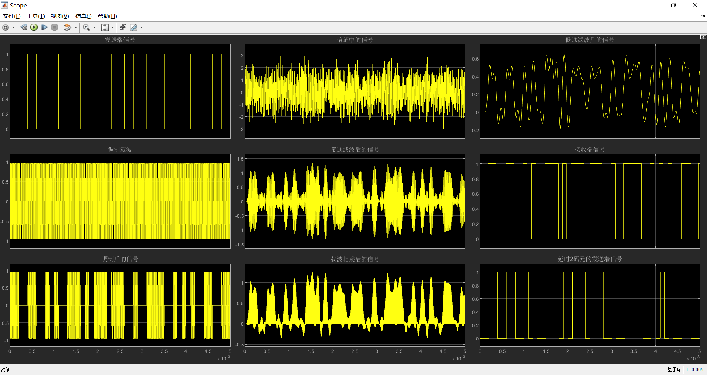
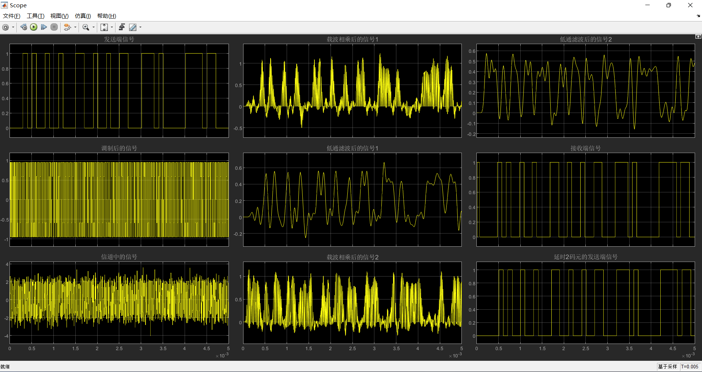
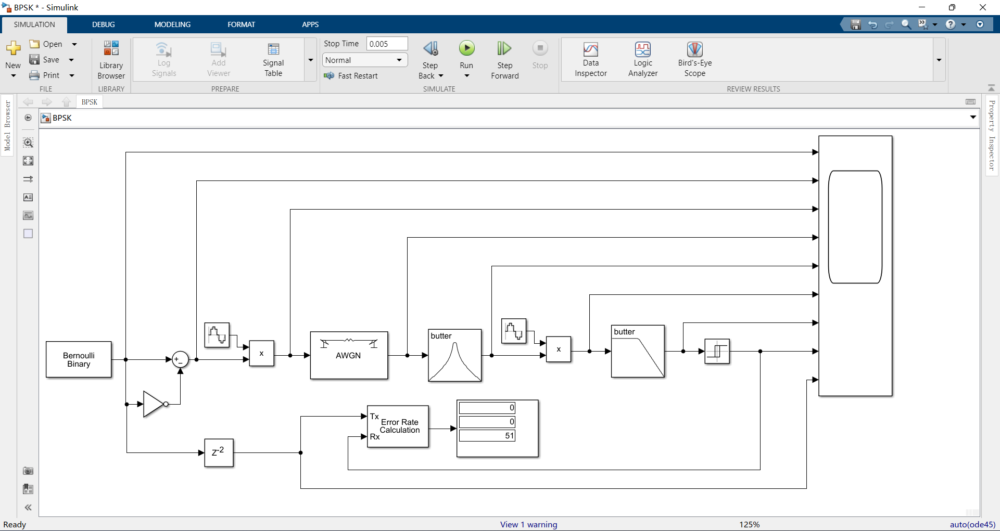

# 项目四阶段一报告

> 姓名：蔡与望
> 学号：2020010801024

## 一、调制-解调系统的基本原理

### 1.1 BASK

二进制幅移键控调制（Binary Amplitude-Shift Keying），通过控制载波的**幅度**来调制信号。

#### 1.1.1 调制原理

假设原始信号为$s(t)$，载波信号$f_c(t)=A\cos(\omega_c t+\theta)$，则调制后的信号为

$$f(t)=\begin{cases}
    s(t)f_c(t), s(t)=1\\\\
    0, s(t)=0
\end{cases}$$

#### 1.1.2 解调原理

先使用带通滤波器，让BASK信号完整通过，滤去其他频段的噪声。然后乘上与调制时完全相同的一列载波，信号被解调为

$$f(t)=\begin{cases}
    \frac{A^2}{2}s(t)+\frac{A^2}{2}\cos(2\omega_ct+2\theta), s(t)=1\\\\
    0, s(t)=0
\end{cases}$$

再通过低通滤波器，滤去高频成分$\frac{A^2}{2}\cos(2\omega_ct+2\theta)$。至此，代表“1”的信号段振幅应接近$\frac{A^2}{2}$，代表“0”的信号段振幅应接近0。

最后，通过参数合适的滞回比较器，就能够还原初始的电平信号。

### 1.2 BFSK

二进制频移键控调制（Binary Frequency-Shift Keying），通过控制载波的**频率**来调制信号。

#### 1.2.1 调制原理

假设原始信号为$s(t)$，载波信号$f_{c_1}(t)=A\cos(\omega_1t+\theta_1)$，$f_{c_2}(t)=A\cos(\omega_2t+\theta_2)$，则调制后的信号为

$$f(t)=\begin{cases}
    f_{c_1}(t), s(t)=1\\\\
    f_{c_2}(t), s(t)=0
\end{cases}$$

#### 1.2.2 解调原理

先仿照BASK，使用带通滤波器、相同载波、低通滤波器解调，高低频载波各得到一个解调信号。这两个解调信号，一个的“1”对应高电平，另一个的“1”对应低电平。然后通过比较器比较这两个电平，就能够判断出真实的原始电平。

### 1.3 BPSK

二进制相移键控调制（Binary Phase-Shift Keying），通过控制载波的**相位**来调制信号。

#### 1.3.1 调制原理

由于在BPSK中，两列载波的相位之差为$\pi$，即瞬时值刚好互为相反数，所以我们可以考虑预先将原始信号变为双极性信号，即将原始信号的0映射到-1；这样我们就可以只使用一列载波，为调制解调大大减少了麻烦。而这样的映射可以通过$s-\overline{s}$实现。

假设原始信号为$s(t)$，载波信号$f_c(t)=A\cos(\omega t+\theta)$，则调制后的信号为

$$f(t)=\begin{cases}
    f_c(t), s(t)=1\\\\
    -f_c(t), s(t)=0
\end{cases}$$

#### 1.3.2 解调原理

与BASK基本相同，使用带通滤波器、相同载波、低通滤波器解调，此时代表“1”的信号段振幅约为$\frac{A^2}{2}$，代表“0”的信号段振幅约为$-\frac{A^2}{2}$。

所以当信号振幅跨越0时，就代表着原始信号0和1的变化，因此使用滞回比较器就能够还原原始信号。

---

## 二、基于Simulink对调制-解调系统的仿真

### 2.1 BASK


上图为BASK仿真系统的结构，可分为调制、信道、解调、输出、检测五大模块。

- **调制**
  - 【伯努利二进制数生成器】1秒设10k个采样点，即基带信号频率为10kHz。
  - 【正弦波】根据采样定理，采样点不能少于20k个；由于是模拟仿真，我们直接设100k个采样点。又因载波频率应远大于基带信号频率，所以我们取正弦波频率为100kHz。

- **信道**
  - 【加性高斯白噪声】模拟真实信道的噪声，这里设SNR=2。

- **解调**
  - 【带通滤波器】下通带截止频率为90kHz（载波频率-信号频率），上通带截止频率为110kHz（载波频率+信号频率）。
  - 【正弦波】由BASK原理可知，参数与调制载波严格一致。
  - 【低通滤波器】截止频率为10kHz（信号频率），因为要把200kHz左右的成分滤掉。
  - 【滞回比较器】阈值需要根据示波器输出进行调试，最终确定在0.25。

- **输出**
  - 【示波器】各端口代表意义见实验结果分析。

- **检测**
  - 【延时模块】接收端信号相比起发送端有一定延迟，所以要将原始信号延时一定时间再进行对比。
  - 【误码率计算器&显示器】显示总传输码元数、误码码元数、误码率。

其余参数均为软件默认值。

下面是仿真结果。



可以看到，调制后的信号、解调后的信号基本都与原理中所描述的一致。接收端最后能基本正确地还原发送端信号，误码率稳定在0.12%，延迟约2bps。


### 2.2 BFSK


上图为BFSK仿真系统的结构，同样可分为调制、信道、解调、输出、检测五大模块。与BASK相同的器件参数在本处不再提及。

- **调制**
  - 【正弦波1】频率为100kHz。
  - 【正弦波2】频率为200kHz。
  - 【选择器】当输入为0时，选择200kHz载波；当输入为1时，选择100kHz载波。

- **解调**
  - 【带通滤波器1】下通带截止频率为90kHz（载波1频率-信号频率），上通带截止频率为110kHz（载波1频率+信号频率）。
  - 【带通滤波器2】下通带截止频率为190kHz（载波2频率-信号频率），上通带截止频率为210kHz（载波2频率+信号频率）。
  - 【正弦波1】由原理，与调制载波1严格一致。
  - 【正弦波2】由原理，与调制载波2严格一致。
  - 【“大于”计算器】当信号1大于信号2，输出1；反之输出2。

- **检测**
  - 【转换为double】由于“大于”计算器的结果是布尔类型，所以在输入误码率计算器前，先将其转换为浮点类型。

下面是仿真结果。



可以看到，调制后的信号、解调后的信号基本都与原理中所描述的一致。接收端最后能基本正确地还原发送端信号，误码率接近于0，延迟约2bps。

但在每次仿真的最开始，接收端都会出现一个高电平毛刺，这一毛刺经过我多次改变元件的尝试，均无法消除。推测其出现的原因是，发送端与接收端之间有延迟，在接收端收到第一个信号前，比较器的输入处于高阻状态，所以输出有异常。但这一毛刺对实际解调的结果没有影响，所以在总的仿真过程中，选择将其忽略不计。


### 2.3 BPSK



上图为BPSK仿真系统的结构，同样可分为调制、信道、解调、输出、检测五大模块。与上面相同的器件参数在本处不再提及。

- **调制**
  - 【非运算&减法器】将单极性信号转换为双极性信号。原理：$f(x)=x-\overline{x}$，$f(1)=1,f(0)=-1$。

下面是仿真结果。


可以看到，调制后的信号、解调后的信号基本都与原理中所描述的一致。接收端最后能基本正确地还原发送端信号，误码率稳定在0.18%，延迟约2bps。


## 三、信道环境对信号的影响

我们容易知道，信噪比SNR越高，误码率BER应当越低。现以BPSK仿真为例，改变AWGN的SNR，记录每次对应的BER并绘图。（绘图源代码见附录）


可以看到，结果与预测基本一致：信噪比越高，误码率越低。当SNR=15时，误码率已经低于万分之一。

## 四、附录

### 4.1 SNR-BER绘图源码

```python
import matplotlib.pyplot as plt
import numpy as np

plt.style.use(['ggplot', 'fast'])

EbNo = np.arange(1, 15.5, 0.5)
BER = np.array([
    1.064e-1,  # 1.0
    9.929e-2,  # 1.5
    9.329e-2,  # 2.0
    8.939e-2,  # 2.5
    8.139e-2,  # 3.0
    7.579e-2,  # 3.5
    6.279e-2,  # 4.0
    6.019e-2,  # 4.5
    5.399e-2,  # 5.0
    4.790e-2,  # 5.5
    4.210e-2,  # 6.0
    3.560e-2,  # 6.5
    3.140e-2,  # 7.0
    2.510e-2,  # 7.5
    1.970e-2,  # 8.0
    1.780e-2,  # 8.5
    1.460e-2,  # 9.0
    1.160e-2,  # 9.5
    9.099e-3,  # 10.0
    7.399e-3,  # 10.5
    5.399e-3,  # 11.0
    4.100e-3,  # 11.5
    3.300e-3,  # 12.0
    1.800e-3,  # 12.5
    9.999e-4,  # 13.0
    6.999e-4,  # 13.5
    4.000e-4,  # 14.0
    2.000e-4,  # 14.5
    1.000e-4,  # 15.0
])
BERlg = np.log10(BER)

plt.title("AWGN's impact on BER")
plt.xlabel('SNR(dB)')
plt.ylabel('$\lgBER$')
plt.yticks(np.arange(-4, 0, 0.5))

plt.plot(EbNo, BERlg)
plt.show()
```
